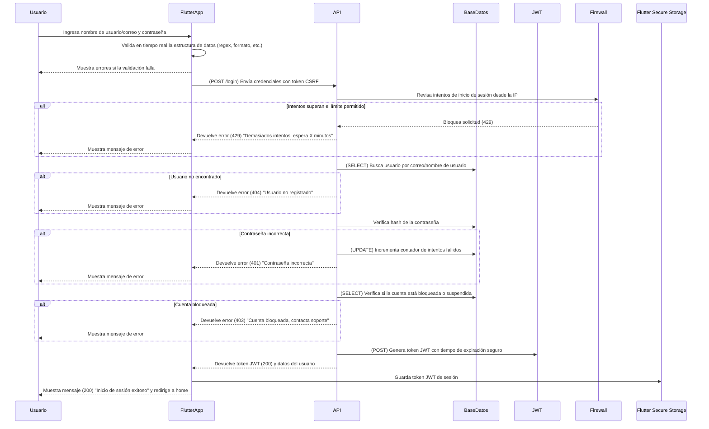

# Inicio de sesión 



Diagrama de secuencia para el **formulario de inicio de sesión**, con los **métodos HTTP, códigos de respuesta y validaciones de seguridad**.

---

## **Diagrama de Secuencia: Inicio de Sesión (Flutter + API + Seguridad)**


### **Seguridad en API y Backend**
1. **Protección contra fuerza bruta:**  
   - Se registra cada intento de inicio de sesión fallido.  
   - Se bloquea temporalmente la IP tras múltiples intentos fallidos.  
   - Recomendar el segunda versión: un CAPTCHA si hay demasiados intentos desde la misma IP.  

2. **Uso de contraseñas seguras:**  
   - Las contraseñas se almacenan encriptadas en la base de datos.  
   - El backend compara la contraseña ingresada con el hash almacenado.  

3. **Generación segura del token JWT:**  
   - Expira en 1 hora para minimizar riesgos.  
   - Incluye `iat` (issued at) y `exp` (expiration).  
   - Se almacena en `flutter_secure_storage` para evitar exposición en localStorage.  

---

## **Métodos HTTP y Respuestas de la API**
| Método   | Endpoint | Descripción                         | Código de respuesta       |
| -------- | -------- | ----------------------------------- | ------------------------- |
| **POST** | `/login` | Inicia sesión con credenciales      | `200` (Éxito)             |
| **POST** | `/login` | Si la cuenta está bloqueada         | `403` (Forbidden)         |
| **POST** | `/login` | Si el usuario no existe             | `404` (Not Found)         |
| **POST** | `/login` | Si la contraseña es incorrecta      | `401` (Unauthorized)      |
| **POST** | `/login` | Si hay demasiados intentos fallidos | `429` (Too Many Requests) |


---

### ** Resumen de Códigos de Estado HTTP**
| Código | Descripción                                         |
| ------ | --------------------------------------------------- |
| `200`  | Inicio de sesión exitoso                            |
| `400`  | Datos faltantes en la solicitud                     |
| `401`  | Credenciales incorrectas o token expirado           |
| `403`  | Cuenta bloqueada o acceso denegado                  |
| `404`  | Usuario no encontrado                               |
| `429`  | Demasiados intentos, acceso bloqueado temporalmente |
| `500`  | Error interno del servidor                          |


Aquí tienes las **estructuras en formato JSON** para las solicitudes y respuestas de la API de **inicio de sesión**. Esto incluye:
- **Solicitud enviada desde Flutter**
- **Respuestas exitosas**
- **Manejo de errores**
- **Códigos de estado HTTP**
- **Mensajes de validación y seguridad**

---

## ** 1. Solicitud desde Flutter (POST /login)**
```json
{
  "email": "usuario@ejemplo.com",
  "password": "P@ssword123!",
  "device_info": {
    "device_id": "f8c9f04a-e3a6-4826-b09a-88c5f3a8b60d",
    "device_name": "Samsung Galaxy S22",
    "os_version": "Android 13",
    "app_version": "1.0.5"
  }
}
```
- `"email"` → Correo electrónico del usuario.
- `"password"` → Contraseña en texto plano (se enviará cifrada en HTTPS).
- `"device_info"` → Datos del dispositivo para mejorar seguridad y detección de accesos sospechosos.

---

## ** 2. Respuesta exitosa (200 OK)**
```json
{
  "status": 200,
  "message": "Inicio de sesión exitoso",
  "user": {
    "id": 12345,
    "name": "Juan Pérez",
    "email": "usuario@ejemplo.com",
    "role": "cliente",
    "profile_picture": "https://cdn.ejemplo.com/avatar123.jpg"
  },
  "token": {
    "access_token": "eyJhbGciOiJIUzI1NiIsInR5...",
    "token_type": "Bearer",
    "expires_in": 3600
  }
}
```
- `"status"` → Código de estado HTTP.
- `"message"` → Mensaje claro de éxito.
- `"user"` → Información básica del usuario autenticado.
- `"token"` → Token JWT generado con su tiempo de expiración.

---

## ** 3. Respuesta si el usuario no existe (404 Not Found)**
```json
{
  "status": 404,
  "message": "Usuario no encontrado. Verifica tu correo o regístrate."
}
```
- `"status"` → Código HTTP `404`.
- `"message"` → Indica que el usuario no existe en la base de datos.

---

## ** 4. Respuesta si la contraseña es incorrecta (401 Unauthorized)**
```json
{
  "status": 401,
  "message": "Contraseña incorrecta. Verifica e intenta nuevamente.",
  "attempts_remaining": 2
}
```
- `"status"` → Código HTTP `401`.
- `"message"` → Mensaje claro para el usuario.
- `"attempts_remaining"` → Muestra cuántos intentos le quedan antes de bloqueo.

---

## ** 5. Respuesta si hay demasiados intentos fallidos (429 Too Many Requests)**
```json
{
  "status": 429,
  "message": "Demasiados intentos fallidos. Intenta nuevamente en 15 minutos.",
  "lockout_until": "2024-02-23T14:35:00Z"
}
```
- `"status"` → Código HTTP `429`.
- `"message"` → Indica que el usuario debe esperar antes de intentar de nuevo.
- `"lockout_until"` → Muestra la fecha/hora exacta en UTC cuando podrá volver a intentar.

---

## ** 6. Respuesta si la cuenta está bloqueada (403 Forbidden)**
```json
{
  "status": 403,
  "message": "Tu cuenta ha sido bloqueada por seguridad. Contacta soporte.",
  "support_email": "soporte@ejemplo.com"
}
```
- `"status"` → Código HTTP `403`.
- `"message"` → Indica que la cuenta está bloqueada.
- `"support_email"` → Correo de soporte para desbloqueo.

---

## ** 7. Respuesta si el servidor tiene un error interno (500 Internal Server Error)**
```json
{
  "status": 500,
  "message": "Error interno del servidor. Inténtalo más tarde.",
  "error_code": "ERR5001"
}
```
- `"status"` → Código HTTP `500`.
- `"message"` → Mensaje genérico para el usuario.
- `"error_code"` → Código interno de error para facilitar la depuración.

---

## ** 8. Respuesta si falta algún campo en la solicitud (400 Bad Request)**
```json
{
  "status": 400,
  "message": "Faltan datos en la solicitud",
  "errors": {
    "email": "El campo email es obligatorio",
    "password": "El campo contraseña es obligatorio"
  }
}
```
- `"status"` → Código HTTP `400`.
- `"message"` → Explica que faltan datos.
- `"errors"` → Lista detallada de los campos con errores.

---

## ** 9. Respuesta si el token JWT ha expirado (401 Unauthorized)**
```json
{
  "status": 401,
  "message": "Tu sesión ha expirado. Inicia sesión nuevamente.",
  "error": "Token Expired"
}
```
- `"status"` → Código HTTP `401`.
- `"message"` → Explica que la sesión ha caducado.
- `"error"` → Identifica que el error es del token.

---

## ** 10. Respuesta si se detecta actividad sospechosa (403 Forbidden)**
```json
{
  "status": 403,
  "message": "Acceso denegado. Intento sospechoso detectado.",
  "security_check": {
    "ip_address": "192.168.1.100",
    "location": "Ciudad de México, México",
    "login_time": "2024-02-23T14:00:00Z"
  }
}
```
- `"status"` → Código HTTP `403`.
- `"message"` → Indica que hubo una alerta de seguridad.
- `"security_check"` → Muestra datos adicionales para identificar la anomalía.

---

## ** 11. Respuesta para cerrar sesión (200 OK)**
```json
{
  "status": 200,
  "message": "Sesión cerrada exitosamente"
}
```
- `"status"` → Código HTTP `200`.
- `"message"` → Indica que el usuario cerró sesión correctamente.

---

## ** 12. Respuesta cuando el usuario no verificó su correo (403 Forbidden)**
```json
{
  "status": 403,
  "message": "Tu correo no ha sido verificado. Revisa tu bandeja de entrada.",
  "resend_link": "https://api.ejemplo.com/resend-verification"
}
```
- `"status"` → Código HTTP `403`.
- `"message"` → Indica que el usuario necesita confirmar su correo.
- `"resend_link"` → URL para reenviar el correo de verificación.

