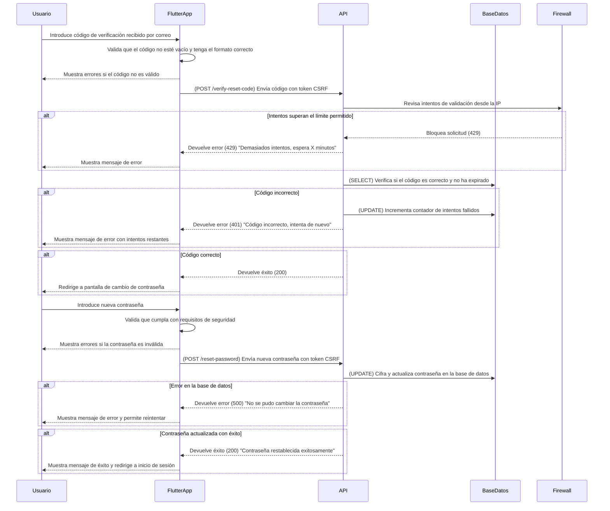

# **Cambio de Contraseña y Validación de Código**



---

## **Diagrama de Secuencia: Cambio de Contraseña (Flutter + API en Python + AWS)**

Este proceso permite a los usuarios restablecer su contraseña de manera **segura y eficiente**, asegurando validaciones en el frontend y protección en el backend.

---

### ✅ **Protecciones de Seguridad en API y Backend**
1. **Protección contra intentos masivos**
   - Se limita el número de intentos de verificación por dirección IP.
   - Se bloquea temporalmente si hay demasiados intentos fallidos (429 Too Many Requests).
   - Se solicita **CAPTCHA** tras varios intentos incorrectos.

2. **Protección CSRF y HTTPS**
   - Se usa un **token CSRF** en cada solicitud de cambio de contraseña.
   - Todas las solicitudes deben realizarse a través de **HTTPS**.

3. **Expiración y Reintentos**
   - El código de verificación tiene un **tiempo de vida limitado**.
   - Se permite reenviar código **solo cada X segundos**.
   - Máximo **3 intentos antes de bloquear la solicitud**.

4. **Almacenamiento seguro de contraseñas**
   - Las nuevas contraseñas se **cifran con bcrypt** antes de ser almacenadas.
   - Se verifica que la nueva contraseña no sea **igual a la anterior**.

---

## **✅ Métodos HTTP y Respuestas de la API**
| Método   | Endpoint             | Descripción                         | Código de respuesta           |
| -------- | -------------------- | ----------------------------------- | ----------------------------- |
| **POST** | `/verify-reset-code` | Verifica código de recuperación     | `200` (Success)               |
| **POST** | `/verify-reset-code` | Si el código es incorrecto          | `401` (Unauthorized)          |
| **POST** | `/verify-reset-code` | Si hay demasiados intentos          | `429` (Too Many Requests)     |
| **POST** | `/reset-password`    | Restablece la contraseña            | `200` (Success)               |
| **POST** | `/reset-password`    | Si hay un error en la actualización | `500` (Internal Server Error) |

---

## **📌 Estructuras JSON de Solicitudes y Respuestas**

### **📌 1. Solicitud desde Flutter (POST /verify-reset-code)**
```json
{
  "email": "usuario@ejemplo.com",
  "verification_code": "123456"
}
```

---

### **📌 2. Respuesta si el código es válido (200 OK)**
```json
{
  "status": 200,
  "message": "Código verificado con éxito. Ahora puedes restablecer tu contraseña."
}
```

---

### **📌 3. Respuesta si el código es incorrecto (401 Unauthorized)**
```json
{
  "status": 401,
  "message": "Código incorrecto. Te quedan 2 intentos."
}
```

---

### **📌 4. Solicitud de cambio de contraseña (POST /reset-password)**
```json
{
  "email": "usuario@ejemplo.com",
  "new_password": "NuevaP@ssword123!"
}
```

---

### **📌 5. Respuesta exitosa al cambiar contraseña (200 OK)**
```json
{
  "status": 200,
  "message": "Contraseña restablecida con éxito. Ahora puedes iniciar sesión."
}
```

---

### **📌 6. Respuesta si hay un error en la actualización (500 Internal Server Error)**
```json
{
  "status": 500,
  "message": "No se pudo cambiar la contraseña. Por favor, inténtalo nuevamente."
}
```

---

## **📌 Resumen de Códigos de Estado HTTP**
| Código | Descripción                                 |
| ------ | ------------------------------------------- |
| `200`  | Cambio de contraseña exitoso                |
| `401`  | Código de verificación incorrecto           |
| `429`  | Demasiados intentos, recuperación bloqueada |
| `500`  | Error en la actualización de la contraseña  |
