# **Listado de Vestidos Cercanos**

```mermaid
sequenceDiagram
    participant Usuario
    participant FlutterApp
    participant API
    participant BaseDatos

    %% Consulta de Categorías
    Usuario->>FlutterApp: Accede a la sección de vestidos
    FlutterApp->>API: (GET /categories) Solicita categorías de vestidos
    API->>BaseDatos: (SELECT) Obtiene categorías disponibles en boutiques cercanas
    API-->>FlutterApp: Devuelve lista de categorías (200)
    FlutterApp-->>Usuario: Muestra categorías disponibles

    %% Listado de Vestidos por Categoría
    Usuario->>FlutterApp: Selecciona una categoría
    FlutterApp->>API: (GET /dresses?category_id=X) Solicita vestidos por categoría
    API->>BaseDatos: (SELECT) Obtiene vestidos disponibles en la categoría
    API-->>FlutterApp: Devuelve lista de vestidos (200)
    FlutterApp-->>Usuario: Muestra vestidos en cuadrícula o lista

    %% Búsqueda por Palabras Clave
    Usuario->>FlutterApp: Ingresa palabra clave en el campo de búsqueda
    FlutterApp->>API: (GET /search-dresses?q=palabra_clave) Solicita búsqueda
    API->>BaseDatos: (SELECT) Busca vestidos o categorías que coincidan
    alt Resultados encontrados
        API-->>FlutterApp: Devuelve lista de vestidos (200)
        FlutterApp-->>Usuario: Muestra resultados en la pantalla
    else No hay coincidencias
        API-->>FlutterApp: Devuelve error (404) "No se encontraron vestidos"
        FlutterApp-->>Usuario: Muestra mensaje de error
    end

    %% Filtrado por Color
    Usuario->>FlutterApp: Selecciona un color
    FlutterApp->>API: (GET /filter-dresses?color=rojo) Solicita vestidos filtrados
    API->>BaseDatos: (SELECT) Filtra vestidos por color
    API-->>FlutterApp: Devuelve vestidos filtrados (200)
    FlutterApp-->>Usuario: Muestra los vestidos disponibles en ese color

    %% Filtrado por Talla
    Usuario->>FlutterApp: Selecciona una talla
    FlutterApp->>API: (GET /filter-dresses?size=M) Solicita vestidos filtrados
    API->>BaseDatos: (SELECT) Filtra vestidos por talla
    API-->>FlutterApp: Devuelve vestidos filtrados (200)
    FlutterApp-->>Usuario: Muestra los vestidos disponibles en esa talla

    %% Filtrado por Rango de Precio
    Usuario->>FlutterApp: Selecciona un rango de precio
    FlutterApp->>API: (GET /filter-dresses?min_price=100&max_price=500) Solicita vestidos filtrados
    API->>BaseDatos: (SELECT) Filtra vestidos dentro del rango de precio
    API-->>FlutterApp: Devuelve vestidos filtrados (200)
    FlutterApp-->>Usuario: Muestra los vestidos disponibles en el rango de precio

    %% Filtrado por Disponibilidad
    Usuario->>FlutterApp: Selecciona estado de disponibilidad
    FlutterApp->>API: (GET /filter-dresses?availability=disponible) Solicita vestidos filtrados
    API->>BaseDatos: (SELECT) Filtra vestidos por disponibilidad
    API-->>FlutterApp: Devuelve vestidos filtrados (200)
    FlutterApp-->>Usuario: Muestra los vestidos disponibles

    %% Presentación de Resultados
    alt Vestidos encontrados
        FlutterApp-->>Usuario: Muestra lista con imágenes, nombre, precio y detalles
    else No se encontraron resultados
        API-->>FlutterApp: Devuelve error (404) "No se encontraron vestidos"
        FlutterApp-->>Usuario: Muestra mensaje de error
    end
```



---

## **Diagrama de Secuencia: Listado de Vestidos Cercanos (Flutter + API en Python + AWS)**

El sistema permite al usuario buscar y filtrar vestidos cercanos mediante categorías y criterios específicos.

---

### ✅ **Protecciones de Seguridad en API y Backend**
1. **Optimización de consultas a la base de datos**
   - Se usa **paginación** para evitar respuestas muy grandes.
   - Se implementan **índices en las tablas** para mejorar la velocidad de búsqueda.

2. **Protección CSRF y HTTPS**
   - Todas las solicitudes a la API deben realizarse con **HTTPS**.
   - Se incluyen **tokens CSRF** en solicitudes sensibles.

3. **Gestión de filtros y búsquedas**
   - Se previene **inyección SQL** con consultas preparadas.
   - Se usa **caché** para búsquedas recurrentes.

---

## **✅ Métodos HTTP y Respuestas de la API**
| Método  | Endpoint                                      | Descripción                      | Código de respuesta                  |
| ------- | --------------------------------------------- | -------------------------------- | ------------------------------------ |
| **GET** | `/categories`                                 | Obtiene categorías de vestidos   | `200` (Success)                      |
| **GET** | `/dresses?category_id=X`                      | Obtiene vestidos por categoría   | `200` (Success)                      |
| **GET** | `/search-dresses?q=X`                         | Busca vestidos por palabra clave | `200` (Success) / `404` (No results) |
| **GET** | `/filter-dresses?color=X`                     | Filtra vestidos por color        | `200` (Success)                      |
| **GET** | `/filter-dresses?size=X`                      | Filtra vestidos por talla        | `200` (Success)                      |
| **GET** | `/filter-dresses?min_price=100&max_price=500` | Filtra por rango de precio       | `200` (Success)                      |
| **GET** | `/filter-dresses?availability=disponible`     | Filtra por disponibilidad        | `200` (Success)                      |

---

## **📌 Estructuras JSON de Solicitudes y Respuestas**

### **📌 1. Solicitud para obtener categorías (GET /categories)**
```json
{
  "status": 200,
  "categories": [
    { "id": 1, "name": "Vestidos de noche" },
    { "id": 2, "name": "Vestidos de novia" },
    { "id": 3, "name": "Vestidos casuales" }
  ]
}
```

---

### **📌 2. Solicitud para obtener vestidos por categoría (GET /dresses?category_id=X)**
```json
{
  "status": 200,
  "dresses": [
    {
      "id": 10,
      "name": "Vestido Elegante Azul",
      "price": 350,
      "availability": "Disponible",
      "colors": ["Azul", "Negro"],
      "sizes": ["S", "M", "L"],
      "image": "https://ejemplo.com/images/vestido1.jpg"
    },
    {
      "id": 11,
      "name": "Vestido Rojo de Fiesta",
      "price": 420,
      "availability": "Últimas unidades",
      "colors": ["Rojo", "Blanco"],
      "sizes": ["M", "L"],
      "image": "https://ejemplo.com/images/vestido2.jpg"
    }
  ]
}
```

---

### **📌 3. Solicitud de búsqueda por palabra clave (GET /search-dresses?q=rojo)**
```json
{
  "status": 200,
  "dresses": [
    {
      "id": 12,
      "name": "Vestido Rojo de Gala",
      "price": 500,
      "availability": "Disponible",
      "colors": ["Rojo"],
      "sizes": ["S", "M"],
      "image": "https://ejemplo.com/images/vestido3.jpg"
    }
  ]
}
```

---

### **📌 4. Respuesta si no se encuentran resultados (404 Not Found)**
```json
{
  "status": 404,
  "message": "No se encontraron vestidos que coincidan con tu búsqueda."
}
```

---

### **📌 5. Solicitud de filtrado por color (GET /filter-dresses?color=rojo)**
```json
{
  "status": 200,
  "dresses": [
    {
      "id": 14,
      "name": "Vestido Rojo Elegante",
      "price": 390,
      "availability": "Disponible",
      "sizes": ["M", "L"],
      "image": "https://ejemplo.com/images/vestido4.jpg"
    }
  ]
}
```
