# **Detalles del Vestido**

```mermaid
sequenceDiagram
    participant Usuario
    participant FlutterApp
    participant API
    participant BaseDatos

    %% Visualización del Vestido
    Usuario->>FlutterApp: Selecciona un vestido de la lista
    FlutterApp->>API: (GET /dress/{id}) Solicita datos del vestido
    API->>BaseDatos: (SELECT) Obtiene detalles del vestido
    alt Consulta exitosa
        API-->>FlutterApp: Devuelve detalles del vestido (200)
        FlutterApp-->>Usuario: Muestra detalles, galería de imágenes y calificación
    else Error en la consulta
        API-->>FlutterApp: Devuelve error (500) "No se pudo cargar la información"
        FlutterApp-->>Usuario: Muestra mensaje de error
    end

    %% Consulta de Reseñas y Calificaciones
    FlutterApp->>API: (GET /dress/{id}/reviews) Solicita reseñas y calificaciones
    API->>BaseDatos: (SELECT) Obtiene reseñas y calificaciones del vestido
    alt Hay reseñas disponibles
        API-->>FlutterApp: Devuelve lista de reseñas (200)
        FlutterApp-->>Usuario: Muestra reseñas y promedio de calificación
    else No hay reseñas
        API-->>FlutterApp: Devuelve mensaje (200) "Este vestido aún no tiene reseñas"
        FlutterApp-->>Usuario: Muestra mensaje de "Sin reseñas"
    end

    %% Agregar a Favoritos
    Usuario->>FlutterApp: Presiona botón "Agregar a Favoritos"
    FlutterApp->>API: (POST /favorites) Asigna el vestido al ID del usuario
    API->>BaseDatos: (INSERT) Guarda vestido en favoritos
    alt Operación exitosa
        API-->>FlutterApp: Devuelve éxito (200) "Vestido agregado a favoritos"
        FlutterApp-->>Usuario: Muestra mensaje de confirmación
    else Error en la operación
        API-->>FlutterApp: Devuelve error (500) "No se pudo agregar el vestido"
        FlutterApp-->>Usuario: Muestra mensaje de error
    end

    %% Guardar en Lista de Deseos
    Usuario->>FlutterApp: Presiona botón "Agregar a Lista de Deseos"
    FlutterApp->>API: (POST /wishlist) Asigna el vestido a la lista de deseos
    API->>BaseDatos: (INSERT) Guarda vestido en la lista de deseos
    alt Operación exitosa
        API-->>FlutterApp: Devuelve éxito (200) "Vestido agregado a la lista de deseos"
        FlutterApp-->>Usuario: Muestra mensaje de confirmación
    else Error en la operación
        API-->>FlutterApp: Devuelve error (500) "No se pudo agregar el vestido"
        FlutterApp-->>Usuario: Muestra mensaje de error
    end

    %% Eliminar de Favoritos
    Usuario->>FlutterApp: Presiona opción "Eliminar de Favoritos"
    FlutterApp->>API: (DELETE /favorites/{id}) Elimina vestido de favoritos
    API->>BaseDatos: (DELETE) Elimina relación del usuario con el vestido
    alt Eliminación exitosa
        API-->>FlutterApp: Devuelve éxito (200) "Vestido eliminado de favoritos"
        FlutterApp-->>Usuario: Muestra mensaje de confirmación
    else Error en la eliminación
        API-->>FlutterApp: Devuelve error (500) "No se pudo eliminar el vestido"
        FlutterApp-->>Usuario: Muestra mensaje de error
    end
```



---

## **Diagrama de Secuencia: Detalles del Vestido (Flutter + API en Python + AWS)**

El flujo permite visualizar todos los detalles del vestido, incluyendo imágenes, reseñas y opciones de favoritos.

---

### ✅ **Protecciones de Seguridad en API y Backend**
1. **Optimización de consultas a la base de datos**
   - Se usa **paginación** en reseñas para evitar grandes cargas de datos.
   - Se implementan **índices en las tablas** para mejorar la velocidad de consulta.

2. **Protección CSRF y HTTPS**
   - Todas las solicitudes a la API deben realizarse con **HTTPS**.
   - Se incluyen **tokens CSRF** en solicitudes de favoritos y lista de deseos.

3. **Gestión de errores y disponibilidad**
   - Si el vestido no está disponible, se muestra un mensaje adecuado.
   - Se previene **inyección SQL** con consultas preparadas.

---

## **✅ Métodos HTTP y Respuestas de la API**
| Método     | Endpoint              | Descripción                               | Código de respuesta                  |
| ---------- | --------------------- | ----------------------------------------- | ------------------------------------ |
| **GET**    | `/dress/{id}`         | Obtiene detalles del vestido seleccionado | `200` (Success)                      |
| **GET**    | `/dress/{id}/reviews` | Obtiene reseñas y calificaciones          | `200` (Success) / `404` (No reviews) |
| **POST**   | `/favorites`          | Agrega vestido a favoritos                | `200` (Success)                      |
| **POST**   | `/wishlist`           | Agrega vestido a lista de deseos          | `200` (Success)                      |
| **DELETE** | `/favorites/{id}`     | Elimina vestido de favoritos              | `200` (Success)                      |

---

## **📌 Estructuras JSON de Solicitudes y Respuestas**

### **📌 1. Solicitud para obtener detalles del vestido (GET /dress/{id})**
```json
{
  "status": 200,
  "dress": {
    "id": 10,
    "name": "Vestido Elegante Azul",
    "description": "Vestido de gala con detalles de encaje.",
    "price": 350,
    "availability": "Disponible",
    "colors": ["Azul", "Negro"],
    "sizes": ["S", "M", "L"],
    "images": [
      "https://ejemplo.com/images/vestido1.jpg",
      "https://ejemplo.com/images/vestido1b.jpg"
    ],
    "average_rating": 4.5,
    "reviews_count": 15
  }
}
```

---

### **📌 2. Solicitud para obtener reseñas (GET /dress/{id}/reviews)**
```json
{
  "status": 200,
  "reviews": [
    {
      "user": "María López",
      "rating": 5,
      "comment": "Me encantó el vestido, es hermoso!",
      "date": "2024-02-23"
    },
    {
      "user": "Ana Gómez",
      "rating": 4,
      "comment": "Muy bonito pero un poco ajustado en la talla M.",
      "date": "2024-02-21"
    }
  ]
}
```

---

### **📌 3. Respuesta si no hay reseñas (200 OK)**
```json
{
  "status": 200,
  "message": "Este vestido aún no tiene reseñas."
}
```

---

### **📌 4. Solicitud para agregar a favoritos (POST /favorites)**
```json
{
  "user_id": 12345,
  "dress_id": 10
}
```

---

### **📌 5. Respuesta exitosa al agregar a favoritos (200 OK)**
```json
{
  "status": 200,
  "message": "Vestido agregado a favoritos."
}
```

---

### **📌 6. Solicitud para eliminar de favoritos (DELETE /favorites/{id})**
```json
{
  "user_id": 12345,
  "dress_id": 10
}
```

---

### **📌 7. Respuesta exitosa al eliminar de favoritos (200 OK)**
```json
{
  "status": 200,
  "message": "Vestido eliminado de favoritos."
}
```

---

## **📌 Resumen de Códigos de Estado HTTP**
| Código | Descripción                      |
| ------ | -------------------------------- |
| `200`  | Operación exitosa                |
| `404`  | Vestido o reseñas no encontradas |
| `500`  | Error en la base de datos        |
