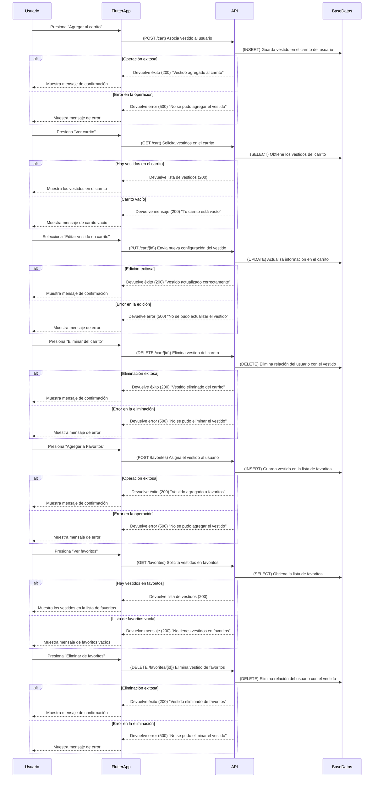

# **Selección de Vestido y Gestión del Carrito**



---

## **Diagrama de Secuencia: Selección de Vestido y Gestión del Carrito (Flutter + API en Python + AWS)**

Este flujo permite a los usuarios agregar, visualizar, modificar y eliminar vestidos del carrito de compras o de la lista de favoritos.

---

### ✅ **Protecciones de Seguridad en API y Backend**
1. **Optimización de consultas**
   - Se usa **paginación** para la visualización del carrito y favoritos.
   - Se implementan **índices en las tablas** para mejorar la velocidad de búsqueda.

2. **Protección CSRF y HTTPS**
   - Todas las solicitudes deben realizarse con **HTTPS**.
   - Se incluyen **tokens CSRF** en solicitudes sensibles.

3. **Gestión de errores y disponibilidad**
   - Se verifica que los vestidos en el carrito aún estén disponibles antes de proceder al pago.
   - Se previene **inyección SQL** con consultas preparadas.

---

## **✅ Métodos HTTP y Respuestas de la API**
| Método     | Endpoint          | Descripción                                    | Código de respuesta             |
| ---------- | ----------------- | ---------------------------------------------- | ------------------------------- |
| **POST**   | `/cart`           | Agrega vestido al carrito                      | `200` (Success)                 |
| **GET**    | `/cart`           | Obtiene los vestidos en el carrito             | `200` (Success) / `404` (Empty) |
| **PUT**    | `/cart/{id}`      | Modifica atributos de un vestido en el carrito | `200` (Success)                 |
| **DELETE** | `/cart/{id}`      | Elimina vestido del carrito                    | `200` (Success)                 |
| **POST**   | `/favorites`      | Agrega vestido a la lista de favoritos         | `200` (Success)                 |
| **GET**    | `/favorites`      | Obtiene la lista de favoritos del usuario      | `200` (Success) / `404` (Empty) |
| **DELETE** | `/favorites/{id}` | Elimina vestido de favoritos                   | `200` (Success)                 |

---

## **📌 Estructuras JSON de Solicitudes y Respuestas**

### **📌 1. Solicitud para agregar al carrito (POST /cart)**
```json
{
  "user_id": 12345,
  "dress_id": 10,
  "size": "M",
  "color": "Rojo"
}
```

---

### **📌 2. Respuesta exitosa al agregar al carrito (200 OK)**
```json
{
  "status": 200,
  "message": "Vestido agregado al carrito."
}
```

---

### **📌 3. Solicitud para obtener el carrito (GET /cart)**
```json
{
  "status": 200,
  "cart_items": [
    {
      "id": 10,
      "name": "Vestido Rojo de Fiesta",
      "price": 420,
      "size": "M",
      "color": "Rojo",
      "availability": "Disponible",
      "image": "https://ejemplo.com/images/vestido1.jpg"
    }
  ]
}
```

---

### **📌 4. Respuesta si el carrito está vacío (200 OK)**
```json
{
  "status": 200,
  "message": "Tu carrito está vacío."
}
```

---

### **📌 5. Respuesta si ocurre un error en el carrito (500 Internal Server Error)**
```json
{
  "status": 500,
  "message": "No se pudo cargar el carrito. Por favor, inténtalo nuevamente."
}
```
