# **Proceso de Reserva**

```mermaid
sequenceDiagram
    participant Usuario
    participant FlutterApp
    participant API
    participant BaseDatos
    participant PasarelaPago

    %% Ver Listado de Tiendas con el Vestido Disponible
    Usuario->>FlutterApp: Selecciona un vestido
    FlutterApp->>API: (GET /boutiques?dress_id=X) Solicita boutiques con el vestido
    API->>BaseDatos: (SELECT) Obtiene boutiques con stock del vestido
    alt Tiendas disponibles
        API-->>FlutterApp: Devuelve lista de boutiques (200)
        FlutterApp-->>Usuario: Muestra boutiques disponibles
    else No hay stock
        API-->>FlutterApp: Devuelve error (404) "No hay boutiques con stock"
        FlutterApp-->>Usuario: Muestra mensaje de error
    end

    %% Selección de Tienda con el Vestido Disponible
    Usuario->>FlutterApp: Selecciona una boutique
    FlutterApp->>API: (GET /boutique/{id}) Solicita detalles de la boutique
    API->>BaseDatos: (SELECT) Obtiene datos de la boutique y el vestido
    alt Datos obtenidos correctamente
        API-->>FlutterApp: Devuelve detalles de la boutique (200)
        FlutterApp-->>Usuario: Muestra información de la boutique
    else Error en la consulta
        API-->>FlutterApp: Devuelve error (500) "No se pudo cargar la información"
        FlutterApp-->>Usuario: Muestra mensaje de error
    end

    %% Selección de Fechas
    Usuario->>FlutterApp: Accede al calendario para seleccionar fecha
    FlutterApp->>API: (GET /availability?boutique_id=X) Solicita disponibilidad
    API->>BaseDatos: (SELECT) Obtiene fechas disponibles en la boutique
    alt Fechas disponibles
        API-->>FlutterApp: Devuelve fechas habilitadas (200)
        FlutterApp-->>Usuario: Muestra calendario interactivo
    else No hay disponibilidad
        API-->>FlutterApp: Devuelve error (400) "No hay fechas disponibles"
        FlutterApp-->>Usuario: Muestra mensaje de error
    end

    %% Verificación de Disponibilidad
    Usuario->>FlutterApp: Selecciona una fecha para la reserva
    FlutterApp->>API: (POST /check-availability) Verifica disponibilidad de la fecha
    API->>BaseDatos: (SELECT) Confirma disponibilidad del vestido en esa fecha
    alt Fecha disponible
        API-->>FlutterApp: Devuelve confirmación (200)
        FlutterApp-->>Usuario: Muestra mensaje "Fecha disponible"
    else Fecha ocupada
        API-->>FlutterApp: Devuelve error (400) "Fecha no disponible"
        FlutterApp-->>Usuario: Muestra mensaje de error
    end

    %% Realizar Pago de Cita o Renta
    Usuario->>FlutterApp: Selecciona método de pago
    FlutterApp->>PasarelaPago: (POST /process-payment) Realiza transacción
    PasarelaPago->>API: Notifica estado del pago
    alt Pago exitoso
        PasarelaPago-->>FlutterApp: Devuelve éxito (200) "Pago confirmado"
        FlutterApp-->>Usuario: Muestra mensaje de éxito
    else Pago fallido
        PasarelaPago-->>FlutterApp: Devuelve error (402) "No se pudo procesar el pago"
        FlutterApp-->>Usuario: Muestra mensaje de error
    end

    %% Agendar Cita en Boutique
    FlutterApp->>API: (POST /schedule-appointment) Registra reserva en la base de datos
    API->>BaseDatos: (INSERT) Guarda reserva con datos del usuario
    alt Agendamiento exitoso
        API-->>FlutterApp: Devuelve éxito (200) "Cita agendada correctamente"
        FlutterApp-->>Usuario: Muestra mensaje de confirmación
    else Error en el agendamiento
        API-->>FlutterApp: Devuelve error (500) "No se pudo agendar la cita"
        FlutterApp-->>Usuario: Muestra mensaje de error
    end

    %% Confirmación de Reserva
    API->>FlutterApp: Envía detalles de la reserva al usuario
    FlutterApp-->>Usuario: Muestra notificación con confirmación

    %% Opciones de Modificación de Reserva
    Usuario->>FlutterApp: Modifica reserva
    FlutterApp->>API: (PUT /update-reservation/{id}) Actualiza datos de la reserva
    API->>BaseDatos: (UPDATE) Modifica datos de la reserva en la base de datos
    alt Actualización exitosa
        API-->>FlutterApp: Devuelve éxito (200) "Reserva actualizada correctamente"
        FlutterApp-->>Usuario: Muestra mensaje de éxito
    else Error en la modificación
        API-->>FlutterApp: Devuelve error (500) "No se pudo actualizar la reserva"
        FlutterApp-->>Usuario: Muestra mensaje de error
    end
```



---

## **Diagrama de Secuencia: Proceso de Reserva (Flutter + API en Python + AWS)**

Este flujo cubre la selección del vestido, la reserva en una boutique, el pago y la confirmación del servicio.

---

### ✅ **Protecciones de Seguridad en API y Backend**
1. **Optimización de consultas**
   - Se usa **paginación** para la lista de boutiques disponibles.
   - Se implementan **índices en las tablas** para mejorar velocidad de búsqueda.

2. **Protección CSRF y HTTPS**
   - Todas las solicitudes deben realizarse con **HTTPS**.
   - Se incluyen **tokens CSRF** en las transacciones.

3. **Gestión de errores y disponibilidad**
   - Se verifican fechas antes de procesar pagos para evitar sobrecargas.
   - Se implementa **manejo de concurrencia** en reservaciones.

---

## **✅ Métodos HTTP y Respuestas de la API**
| Método   | Endpoint                      | Descripción                                 | Código de respuesta                         |
| -------- | ----------------------------- | ------------------------------------------- | ------------------------------------------- |
| **GET**  | `/boutiques?dress_id=X`       | Obtiene boutiques con el vestido disponible | `200` (Success) / `404` (No stock)          |
| **GET**  | `/boutique/{id}`              | Obtiene detalles de la boutique             | `200` (Success) / `500` (Error)             |
| **GET**  | `/availability?boutique_id=X` | Consulta fechas disponibles en boutique     | `200` (Success) / `400` (No disponibilidad) |
| **POST** | `/check-availability`         | Verifica disponibilidad de fecha            | `200` (Available) / `400` (No disponible)   |
| **POST** | `/process-payment`            | Procesa pago de reserva                     | `200` (Success) / `402` (Payment Failed)    |
| **POST** | `/schedule-appointment`       | Registra reserva en la base de datos        | `200` (Success) / `500` (Error)             |
| **PUT**  | `/update-reservation/{id}`    | Modifica detalles de la reserva             | `200` (Success) / `500` (Error)             |

---

## **📌 Estructuras JSON de Solicitudes y Respuestas**

### **📌 1. Solicitud para obtener boutiques disponibles (GET /boutiques?dress_id=X)**
```json
{
  "status": 200,
  "boutiques": [
    {
      "id": 1,
      "name": "Glamour Boutique",
      "address": "Av. Reforma 123, CDMX",
      "availability": true
    }
  ]
}
```

---

### **📌 2. Solicitud para verificar disponibilidad (POST /check-availability)**
```json
{
  "boutique_id": 1,
  "dress_id": 10,
  "selected_date": "2024-03-10"
}
```

---

### **📌 3. Respuesta de fecha disponible (200 OK)**
```json
{
  "status": 200,
  "message": "Fecha disponible para reserva"
}
```

---

### **📌 4. Solicitud para procesar pago (POST /process-payment)**
```json
{
  "user_id": 12345,
  "amount": 500.00,
  "payment_method": "Tarjeta de crédito"
}
```

---

### **📌 5. Respuesta si el pago es exitoso (200 OK)**
```json
{
  "status": 200,
  "message": "Pago confirmado"
}
```
