# **Notificaciones y Alertas**

```mermaid
sequenceDiagram
    participant Usuario
    participant FlutterApp
    participant API_Notificaciones
    participant API_Citas
    participant API_Pagos
    participant BaseDatos
    participant Correo

    %% Recordatorio de Citas
    API_Citas->>BaseDatos: (SELECT) Obtiene citas programadas para el día siguiente
    alt Citas encontradas
        API_Citas-->>API_Notificaciones: Envía citas a notificar
        API_Notificaciones->>FlutterApp: (PUSH) Envía recordatorio al usuario
        API_Notificaciones->>Correo: (EMAIL) Envía recordatorio por correo
        API_Notificaciones-->>BaseDatos: Registra notificación enviada (LOG)
    else No hay citas
        API_Citas-->>API_Notificaciones: No hay citas que notificar
    end

    %% Confirmación de Pago
    API_Pagos->>BaseDatos: (INSERT) Registra pago exitoso
    API_Pagos-->>API_Notificaciones: Notifica pago confirmado
    API_Notificaciones->>FlutterApp: (PUSH) Notifica pago exitoso
    API_Notificaciones->>Correo: (EMAIL) Envía confirmación de pago
    API_Notificaciones-->>BaseDatos: Registra notificación enviada (LOG)

    %% Recordatorio de Devolución
    API_Citas->>BaseDatos: (SELECT) Obtiene devoluciones programadas para el día siguiente
    alt Devoluciones encontradas
        API_Citas-->>API_Notificaciones: Envía devoluciones a notificar
        API_Notificaciones->>FlutterApp: (PUSH) Envía recordatorio al usuario
        API_Notificaciones->>Correo: (EMAIL) Envía recordatorio por correo
        API_Notificaciones-->>BaseDatos: Registra notificación enviada (LOG)
    else No hay devoluciones
        API_Citas-->>API_Notificaciones: No hay devoluciones que notificar
    end

    %% Manejo de Errores
    alt Error al enviar notificación
        API_Notificaciones-->>BaseDatos: Registra error (LOG)
        API_Notificaciones-->>Usuario: Muestra error en historial
    end
```



---

## **📌 Métodos HTTP y Respuestas de la API**
| Método   | Endpoint                      | Descripción                            | Código de respuesta                       |
| -------- | ----------------------------- | -------------------------------------- | ----------------------------------------- |
| **GET**  | `/notifications/appointments` | Consulta citas próximas para notificar | `200` (Success) / `404` (No citas)        |
| **POST** | `/notifications/send`         | Envía notificaciones (Push/Email)      | `200` (Success) / `500` (Error)           |
| **GET**  | `/notifications/payments`     | Notifica pago exitoso                  | `200` (Success) / `500` (Error)           |
| **GET**  | `/notifications/returns`      | Consulta devoluciones para notificar   | `200` (Success) / `404` (No devoluciones) |

---

## **📌 1. Solicitud para obtener citas a notificar (GET /notifications/appointments)**
### 📥 **Solicitud**
```json
{
  "date": "2024-03-15"
}
```

### 📤 **Respuesta Exitosa (200 OK)**
```json
{
  "status": 200,
  "appointments": [
    {
      "user_id": 12345,
      "boutique": "Boutique Elegance",
      "date": "2024-03-16",
      "time": "14:00"
    }
  ]
}
```

### 📤 **Respuesta si no hay citas (404 Not Found)**
```json
{
  "status": 404,
  "message": "No hay citas programadas para notificar."
}
```

---

## **📌 2. Solicitud para enviar notificación (POST /notifications/send)**
### 📥 **Solicitud**
```json
{
  "user_id": 12345,
  "type": "appointment_reminder",
  "message": "Recuerda que tienes una cita mañana en Boutique Elegance a las 14:00."
}
```

### 📤 **Respuesta de Notificación Enviada (200 OK)**
```json
{
  "status": 200,
  "message": "Notificación enviada correctamente."
}
```

### 📤 **Respuesta de Error al Enviar Notificación (500 Internal Server Error)**
```json
{
  "status": 500,
  "message": "No se pudo enviar la notificación. Se intentará nuevamente."
}
```

---

## **📌 3. Solicitud para confirmar pago (GET /notifications/payments)**
### 📥 **Solicitud**
```json
{
  "transaction_id": "TXN998877",
  "user_id": 12345
}
```

### 📤 **Respuesta de Pago Confirmado (200 OK)**
```json
{
  "status": 200,
  "message": "Tu pago ha sido procesado con éxito. Gracias por tu compra."
}
```

### 📤 **Respuesta de Error al Enviar Notificación (500 Internal Server Error)**
```json
{
  "status": 500,
  "message": "No se pudo enviar la confirmación de pago. Se intentará nuevamente."
}
```

---

## **📌 4. Solicitud para notificar devolución (GET /notifications/returns)**
### 📥 **Solicitud**
```json
{
  "date": "2024-03-15"
}
```

### 📤 **Respuesta Exitosa (200 OK)**
```json
{
  "status": 200,
  "returns": [
    {
      "user_id": 12345,
      "boutique": "Glamour Fashion",
      "return_date": "2024-03-16"
    }
  ]
}
```

### 📤 **Respuesta si no hay devoluciones (404 Not Found)**
```json
{
  "status": 404,
  "message": "No hay devoluciones programadas para notificar."
}
```

---

## **📌 Optimizaciones y Mejoras**
### ✅ **Notificaciones Push**
- Además del correo electrónico, se pueden enviar **notificaciones push** en tiempo real.

### ✅ **Historial de Notificaciones**
- El usuario podrá ver **un historial de todas las notificaciones** recibidas.

### ✅ **Reintentos en Errores**
- Si una notificación no se envía correctamente, se **reintenta automáticamente** en intervalos programados.
