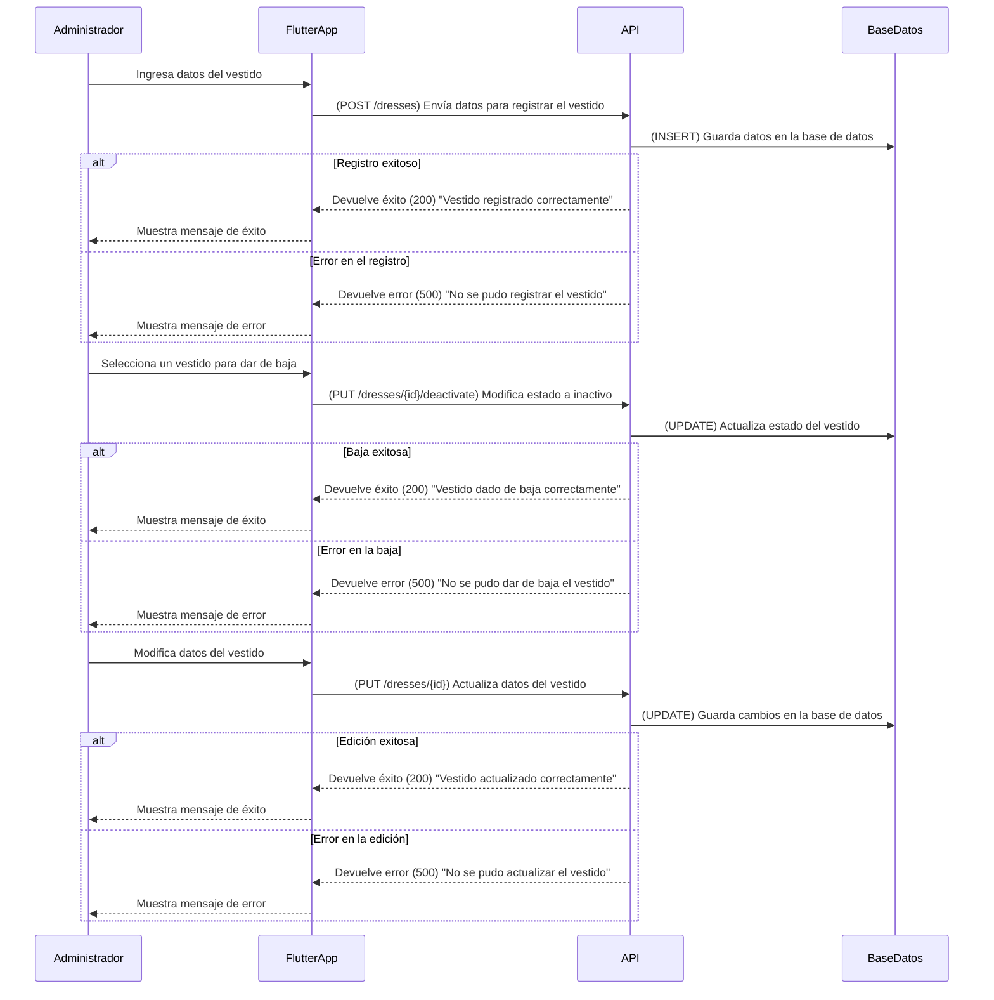
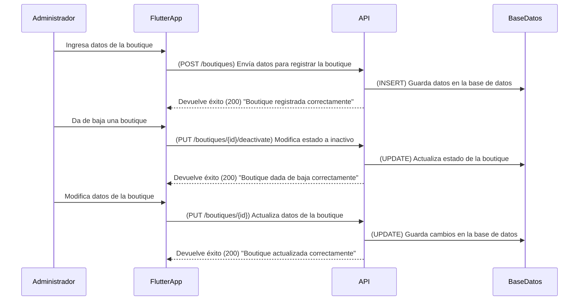
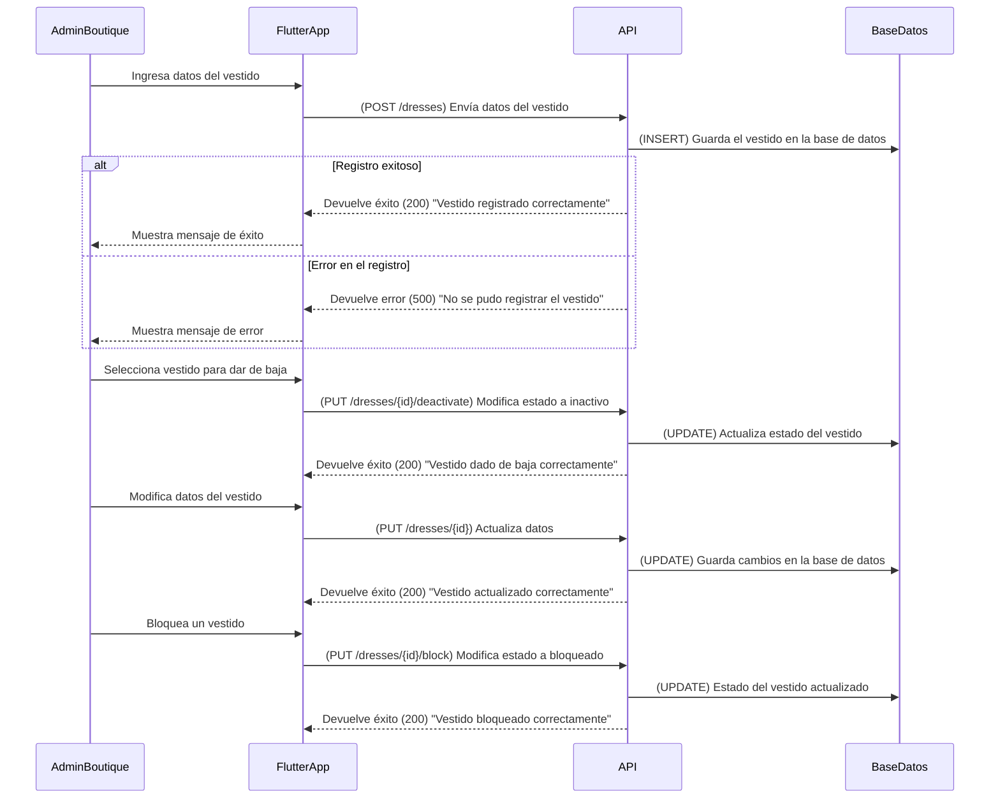
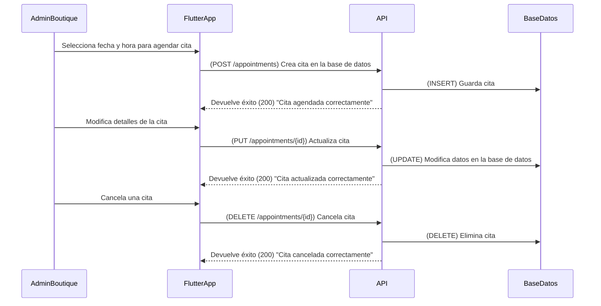
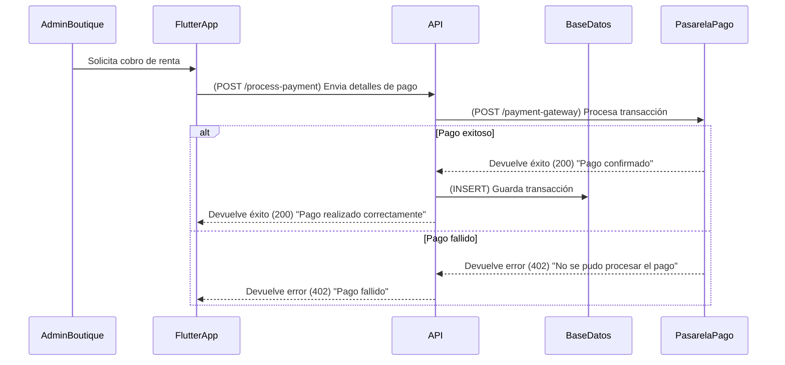

# **Administración de la Plataforma**

## **Diagrama de Secuencia: Gestión de Vestidos**


---

## **📌 Métodos HTTP y Respuestas de la API**
| Método   | Endpoint                   | Descripción                      | Código de respuesta             |
| -------- | -------------------------- | -------------------------------- | ------------------------------- |
| **POST** | `/dresses`                 | Registra un nuevo vestido        | `200` (Success) / `500` (Error) |
| **PUT**  | `/dresses/{id}/deactivate` | Da de baja un vestido            | `200` (Success) / `500` (Error) |
| **PUT**  | `/dresses/{id}`            | Modifica los datos de un vestido | `200` (Success) / `500` (Error) |

---

## **📌 1. Solicitud para registrar un vestido (POST /dresses)**
### 📥 **Solicitud**
```json
{
  "name": "Vestido de Gala Azul",
  "brand": "Elegance",
  "price": 120.00,
  "color": "Azul",
  "size": ["S", "M", "L"],
  "quantity": 5,
  "status": "activo",
  "image_url": "https://ejemplo.com/vestido.jpg"
}
```

### 📤 **Respuesta Exitosa (200 OK)**
```json
{
  "status": 200,
  "message": "Vestido registrado correctamente",
  "dress_id": 101
}
```

### 📤 **Respuesta de Error (500 Internal Server Error)**
```json
{
  "status": 500,
  "message": "No se pudo registrar el vestido. Por favor, verifica los datos e inténtalo nuevamente."
}
```

---

## **📌 2. Solicitud para dar de baja un vestido (PUT /dresses/{id}/deactivate)**
### 📥 **Solicitud**
```json
{
  "status": "inactivo"
}
```

### 📤 **Respuesta Exitosa (200 OK)**
```json
{
  "status": 200,
  "message": "Vestido dado de baja correctamente"
}
```

---

## **📌 3. Solicitud para modificar un vestido (PUT /dresses/{id})**
### 📥 **Solicitud**
```json
{
  "name": "Vestido de Gala Azul Noche",
  "price": 130.00,
  "size": ["M", "L"],
  "status": "activo"
}
```

### 📤 **Respuesta Exitosa (200 OK)**
```json
{
  "status": 200,
  "message": "Vestido actualizado correctamente"
}
```

---

## **📌 Optimizaciones y Mejoras**
### ✅ **Historial de Cambios**
- Se guarda un historial de modificaciones realizadas sobre los vestidos.

### ✅ **Validaciones en Tiempo Real**
- El formulario valida los datos antes de enviarlos.

---

## **Diagrama de Secuencia: Gestión de Boutiques**


---

## **📌 Métodos HTTP y Respuestas de la API**
| Método   | Endpoint                     | Descripción                        | Código de respuesta             |
| -------- | ---------------------------- | ---------------------------------- | ------------------------------- |
| **POST** | `/boutiques`                 | Registra una nueva boutique        | `200` (Success) / `500` (Error) |
| **PUT**  | `/boutiques/{id}/deactivate` | Da de baja una boutique            | `200` (Success) / `500` (Error) |
| **PUT**  | `/boutiques/{id}`            | Modifica los datos de una boutique | `200` (Success) / `500` (Error) |

---

## **📌 1. Solicitud para registrar una boutique (POST /boutiques)**
### 📥 **Solicitud**
```json
{
  "name": "Boutique Elegance",
  "address": "Av. Reforma 123, CDMX",
  "image_url": "https://ejemplo.com/boutique.jpg"
}
```

### 📤 **Respuesta Exitosa (200 OK)**
```json
{
  "status": 200,
  "message": "Boutique registrada correctamente",
  "boutique_id": 10
}
```

---

## **📌 2. Solicitud para dar de baja una boutique (PUT /boutiques/{id}/deactivate)**
### 📥 **Solicitud**
```json
{
  "status": "inactivo"
}
```

### 📤 **Respuesta Exitosa (200 OK)**
```json
{
  "status": 200,
  "message": "Boutique dada de baja correctamente"
}
```

---

## **📌 3. Solicitud para modificar una boutique (PUT /boutiques/{id})**
### 📥 **Solicitud**
```json
{
  "name": "Boutique Glamour",
  "address": "Av. Insurgentes 456, CDMX"
}
```

### 📤 **Respuesta Exitosa (200 OK)**
```json
{
  "status": 200,
  "message": "Boutique actualizada correctamente"
}
```


# **Administración de Boutique**

---

## **Diagrama de Secuencia: Gestión de Vestidos**


---

## **📌 Métodos HTTP y Respuestas de la API**
| Método   | Endpoint                   | Descripción                      | Código de respuesta             |
| -------- | -------------------------- | -------------------------------- | ------------------------------- |
| **POST** | `/dresses`                 | Registra un nuevo vestido        | `200` (Success) / `500` (Error) |
| **PUT**  | `/dresses/{id}/deactivate` | Da de baja un vestido            | `200` (Success) / `500` (Error) |
| **PUT**  | `/dresses/{id}`            | Modifica los datos de un vestido | `200` (Success) / `500` (Error) |
| **PUT**  | `/dresses/{id}/block`      | Bloquea un vestido               | `200` (Success) / `500` (Error) |

---

## **📌 1. Solicitud para registrar un vestido (POST /dresses)**
### 📥 **Solicitud**
```json
{
  "name": "Vestido de Fiesta Rojo",
  "brand": "Elegance",
  "price": 150.00,
  "color": "Rojo",
  "size": ["S", "M", "L"],
  "quantity": 3,
  "status": "activo",
  "image_url": "https://ejemplo.com/vestido.jpg",
  "boutique_id": 10
}
```

### 📤 **Respuesta Exitosa (200 OK)**
```json
{
  "status": 200,
  "message": "Vestido registrado correctamente",
  "dress_id": 201
}
```

---

## **Diagrama de Secuencia: Gestión de Citas**


---

## **📌 Métodos HTTP y Respuestas de la API**
| Método     | Endpoint             | Descripción                    | Código de respuesta             |
| ---------- | -------------------- | ------------------------------ | ------------------------------- |
| **POST**   | `/appointments`      | Agenda una nueva cita          | `200` (Success) / `500` (Error) |
| **PUT**    | `/appointments/{id}` | Modifica los datos de una cita | `200` (Success) / `500` (Error) |
| **DELETE** | `/appointments/{id}` | Cancela una cita               | `200` (Success) / `500` (Error) |

---

## **📌 2. Solicitud para agendar una cita (POST /appointments)**
### 📥 **Solicitud**
```json
{
  "boutique_id": 10,
  "user_id": 12345,
  "dress_id": 201,
  "date": "2024-04-15",
  "time": "14:00",
  "status": "pendiente"
}
```

### 📤 **Respuesta Exitosa (200 OK)**
```json
{
  "status": 200,
  "message": "Cita agendada correctamente",
  "appointment_id": 502
}
```

---

## **Diagrama de Secuencia: Gestión de Pagos**


---

## **📌 Métodos HTTP y Respuestas de la API**
| Método   | Endpoint           | Descripción                  | Código de respuesta                      |
| -------- | ------------------ | ---------------------------- | ---------------------------------------- |
| **POST** | `/process-payment` | Procesa el pago de una renta | `200` (Success) / `402` (Payment Failed) |

---

## **📌 3. Solicitud para procesar pago de renta (POST /process-payment)**
### 📥 **Solicitud**
```json
{
  "user_id": 12345,
  "boutique_id": 10,
  "amount": 150.00,
  "payment_method": "Tarjeta de Crédito",
  "transaction_type": "renta"
}
```

### 📤 **Respuesta Exitosa (200 OK)**
```json
{
  "status": 200,
  "message": "Pago confirmado",
  "transaction_id": "TXN303030"
}
```