```mermaid
sequenceDiagram
    participant Administrador
    participant FlutterApp
    participant API
    participant BaseDatos

    %% Alta de Vestidos
    Administrador->>FlutterApp: Ingresa datos del vestido
    FlutterApp->>API: (POST /dresses) Envía datos para registrar el vestido
    API->>BaseDatos: (INSERT) Guarda datos en la base de datos
    alt Registro exitoso
        API-->>FlutterApp: Devuelve éxito (200) "Vestido registrado correctamente"
        FlutterApp-->>Administrador: Muestra mensaje de éxito
    else Error en el registro
        API-->>FlutterApp: Devuelve error (500) "No se pudo registrar el vestido"
        FlutterApp-->>Administrador: Muestra mensaje de error
    end

    %% Baja de Vestidos
    Administrador->>FlutterApp: Selecciona un vestido para dar de baja
    FlutterApp->>API: (PUT /dresses/{id}/deactivate) Modifica estado a inactivo
    API->>BaseDatos: (UPDATE) Actualiza estado del vestido
    alt Baja exitosa
        API-->>FlutterApp: Devuelve éxito (200) "Vestido dado de baja correctamente"
        FlutterApp-->>Administrador: Muestra mensaje de éxito
    else Error en la baja
        API-->>FlutterApp: Devuelve error (500) "No se pudo dar de baja el vestido"
        FlutterApp-->>Administrador: Muestra mensaje de error
    end

    %% Modificación de Vestidos
    Administrador->>FlutterApp: Modifica datos del vestido
    FlutterApp->>API: (PUT /dresses/{id}) Actualiza datos del vestido
    API->>BaseDatos: (UPDATE) Guarda cambios en la base de datos
    alt Edición exitosa
        API-->>FlutterApp: Devuelve éxito (200) "Vestido actualizado correctamente"
        FlutterApp-->>Administrador: Muestra mensaje de éxito
    else Error en la edición
        API-->>FlutterApp: Devuelve error (500) "No se pudo actualizar el vestido"
        FlutterApp-->>Administrador: Muestra mensaje de error
    end
```

```mermaid
sequenceDiagram
    participant AdminBoutique
    participant FlutterApp
    participant API
    participant BaseDatos

    %% Alta de Vestidos
    AdminBoutique->>FlutterApp: Ingresa datos del vestido
    FlutterApp->>API: (POST /dresses) Envía datos del vestido
    API->>BaseDatos: (INSERT) Guarda el vestido en la base de datos
    alt Registro exitoso
        API-->>FlutterApp: Devuelve éxito (200) "Vestido registrado correctamente"
        FlutterApp-->>AdminBoutique: Muestra mensaje de éxito
    else Error en el registro
        API-->>FlutterApp: Devuelve error (500) "No se pudo registrar el vestido"
        FlutterApp-->>AdminBoutique: Muestra mensaje de error
    end

    %% Baja de Vestidos
    AdminBoutique->>FlutterApp: Selecciona vestido para dar de baja
    FlutterApp->>API: (PUT /dresses/{id}/deactivate) Modifica estado a inactivo
    API->>BaseDatos: (UPDATE) Actualiza estado del vestido
    API-->>FlutterApp: Devuelve éxito (200) "Vestido dado de baja correctamente"

    %% Modificación de Vestidos
    AdminBoutique->>FlutterApp: Modifica datos del vestido
    FlutterApp->>API: (PUT /dresses/{id}) Actualiza datos
    API->>BaseDatos: (UPDATE) Guarda cambios en la base de datos
    API-->>FlutterApp: Devuelve éxito (200) "Vestido actualizado correctamente"

    %% Bloqueo de Vestidos
    AdminBoutique->>FlutterApp: Bloquea un vestido
    FlutterApp->>API: (PUT /dresses/{id}/block) Modifica estado a bloqueado
    API->>BaseDatos: (UPDATE) Estado del vestido actualizado
    API-->>FlutterApp: Devuelve éxito (200) "Vestido bloqueado correctamente"
```

# **Administración de la Plataforma**

## **Diagrama de Secuencia: Gestión de Vestidos**


---

## **📌 Métodos HTTP y Respuestas de la API**
| Método   | Endpoint                   | Descripción                      | Código de respuesta             |
| -------- | -------------------------- | -------------------------------- | ------------------------------- |
| **POST** | `/dresses`                 | Registra un nuevo vestido        | `200` (Success) / `500` (Error) |
| **PUT**  | `/dresses/{id}/deactivate` | Da de baja un vestido            | `200` (Success) / `500` (Error) |
| **PUT**  | `/dresses/{id}`            | Modifica los datos de un vestido | `200` (Success) / `500` (Error) |

---

## **📌 1. Solicitud para registrar un vestido (POST /dresses)**
### 📥 **Solicitud**
```json
{
  "name": "Vestido de Gala Azul",
  "brand": "Elegance",
  "price": 120.00,
  "color": "Azul",
  "size": ["S", "M", "L"],
  "quantity": 5,
  "status": "activo",
  "image_url": "https://ejemplo.com/vestido.jpg"
}
```

### 📤 **Respuesta Exitosa (200 OK)**
```json
{
  "status": 200,
  "message": "Vestido registrado correctamente",
  "dress_id": 101
}
```

### 📤 **Respuesta de Error (500 Internal Server Error)**
```json
{
  "status": 500,
  "message": "No se pudo registrar el vestido. Por favor, verifica los datos e inténtalo nuevamente."
}
```

---

## **📌 2. Solicitud para dar de baja un vestido (PUT /dresses/{id}/deactivate)**
### 📥 **Solicitud**
```json
{
  "status": "inactivo"
}
```

### 📤 **Respuesta Exitosa (200 OK)**
```json
{
  "status": 200,
  "message": "Vestido dado de baja correctamente"
}
```

---

## **📌 3. Solicitud para modificar un vestido (PUT /dresses/{id})**
### 📥 **Solicitud**
```json
{
  "name": "Vestido de Gala Azul Noche",
  "price": 130.00,
  "size": ["M", "L"],
  "status": "activo"
}
```

### 📤 **Respuesta Exitosa (200 OK)**
```json
{
  "status": 200,
  "message": "Vestido actualizado correctamente"
}
```

---

## **📌 Optimizaciones y Mejoras**
### ✅ **Historial de Cambios**
- Se guarda un historial de modificaciones realizadas sobre los vestidos.

### ✅ **Validaciones en Tiempo Real**
- El formulario valida los datos antes de enviarlos.

---

## **Diagrama de Secuencia: Gestión de Boutiques**

```mermaid
sequenceDiagram
    participant Administrador
    participant FlutterApp
    participant API
    participant BaseDatos

    %% Alta de Boutique
    Administrador->>FlutterApp: Ingresa datos de la boutique
    FlutterApp->>API: (POST /boutiques) Envía datos para registrar la boutique
    API->>BaseDatos: (INSERT) Guarda datos en la base de datos
    API-->>FlutterApp: Devuelve éxito (200) "Boutique registrada correctamente"

    %% Baja de Boutique
    Administrador->>FlutterApp: Da de baja una boutique
    FlutterApp->>API: (PUT /boutiques/{id}/deactivate) Modifica estado a inactivo
    API->>BaseDatos: (UPDATE) Actualiza estado de la boutique
    API-->>FlutterApp: Devuelve éxito (200) "Boutique dada de baja correctamente"

    %% Modificación de Boutique
    Administrador->>FlutterApp: Modifica datos de la boutique
    FlutterApp->>API: (PUT /boutiques/{id}) Actualiza datos de la boutique
    API->>BaseDatos: (UPDATE) Guarda cambios en la base de datos
    API-->>FlutterApp: Devuelve éxito (200) "Boutique actualizada correctamente"
```


---

## **📌 Métodos HTTP y Respuestas de la API**
| Método   | Endpoint                     | Descripción                        | Código de respuesta             |
| -------- | ---------------------------- | ---------------------------------- | ------------------------------- |
| **POST** | `/boutiques`                 | Registra una nueva boutique        | `200` (Success) / `500` (Error) |
| **PUT**  | `/boutiques/{id}/deactivate` | Da de baja una boutique            | `200` (Success) / `500` (Error) |
| **PUT**  | `/boutiques/{id}`            | Modifica los datos de una boutique | `200` (Success) / `500` (Error) |

---

## **📌 1. Solicitud para registrar una boutique (POST /boutiques)**
### 📥 **Solicitud**
```json
{
  "name": "Boutique Elegance",
  "address": "Av. Reforma 123, CDMX",
  "image_url": "https://ejemplo.com/boutique.jpg"
}
```

### 📤 **Respuesta Exitosa (200 OK)**
```json
{
  "status": 200,
  "message": "Boutique registrada correctamente",
  "boutique_id": 10
}
```

---

## **📌 2. Solicitud para dar de baja una boutique (PUT /boutiques/{id}/deactivate)**
### 📥 **Solicitud**
```json
{
  "status": "inactivo"
}
```

### 📤 **Respuesta Exitosa (200 OK)**
```json
{
  "status": 200,
  "message": "Boutique dada de baja correctamente"
}
```

---

## **📌 3. Solicitud para modificar una boutique (PUT /boutiques/{id})**
### 📥 **Solicitud**
```json
{
  "name": "Boutique Glamour",
  "address": "Av. Insurgentes 456, CDMX"
}
```

### 📤 **Respuesta Exitosa (200 OK)**
```json
{
  "status": 200,
  "message": "Boutique actualizada correctamente"
}
```


# **Administración de Boutique**

---

## **Diagrama de Secuencia: Gestión de Vestidos**


---

## **📌 Métodos HTTP y Respuestas de la API**
| Método   | Endpoint                   | Descripción                      | Código de respuesta             |
| -------- | -------------------------- | -------------------------------- | ------------------------------- |
| **POST** | `/dresses`                 | Registra un nuevo vestido        | `200` (Success) / `500` (Error) |
| **PUT**  | `/dresses/{id}/deactivate` | Da de baja un vestido            | `200` (Success) / `500` (Error) |
| **PUT**  | `/dresses/{id}`            | Modifica los datos de un vestido | `200` (Success) / `500` (Error) |
| **PUT**  | `/dresses/{id}/block`      | Bloquea un vestido               | `200` (Success) / `500` (Error) |

---

## **📌 1. Solicitud para registrar un vestido (POST /dresses)**
### 📥 **Solicitud**
```json
{
  "name": "Vestido de Fiesta Rojo",
  "brand": "Elegance",
  "price": 150.00,
  "color": "Rojo",
  "size": ["S", "M", "L"],
  "quantity": 3,
  "status": "activo",
  "image_url": "https://ejemplo.com/vestido.jpg",
  "boutique_id": 10
}
```

### 📤 **Respuesta Exitosa (200 OK)**
```json
{
  "status": 200,
  "message": "Vestido registrado correctamente",
  "dress_id": 201
}
```

---

## **Diagrama de Secuencia: Gestión de Citas**

```mermaid
sequenceDiagram
    participant AdminBoutique
    participant FlutterApp
    participant API
    participant BaseDatos

    %% Agendar Cita
    AdminBoutique->>FlutterApp: Selecciona fecha y hora para agendar cita
    FlutterApp->>API: (POST /appointments) Crea cita en la base de datos
    API->>BaseDatos: (INSERT) Guarda cita
    API-->>FlutterApp: Devuelve éxito (200) "Cita agendada correctamente"

    %% Modificación de Citas
    AdminBoutique->>FlutterApp: Modifica detalles de la cita
    FlutterApp->>API: (PUT /appointments/{id}) Actualiza cita
    API->>BaseDatos: (UPDATE) Modifica datos en la base de datos
    API-->>FlutterApp: Devuelve éxito (200) "Cita actualizada correctamente"

    %% Cancelación de Citas
    AdminBoutique->>FlutterApp: Cancela una cita
    FlutterApp->>API: (DELETE /appointments/{id}) Cancela cita
    API->>BaseDatos: (DELETE) Elimina cita
    API-->>FlutterApp: Devuelve éxito (200) "Cita cancelada correctamente"
```


---

## **📌 Métodos HTTP y Respuestas de la API**
| Método     | Endpoint             | Descripción                    | Código de respuesta             |
| ---------- | -------------------- | ------------------------------ | ------------------------------- |
| **POST**   | `/appointments`      | Agenda una nueva cita          | `200` (Success) / `500` (Error) |
| **PUT**    | `/appointments/{id}` | Modifica los datos de una cita | `200` (Success) / `500` (Error) |
| **DELETE** | `/appointments/{id}` | Cancela una cita               | `200` (Success) / `500` (Error) |

---

## **📌 2. Solicitud para agendar una cita (POST /appointments)**
### 📥 **Solicitud**
```json
{
  "boutique_id": 10,
  "user_id": 12345,
  "dress_id": 201,
  "date": "2024-04-15",
  "time": "14:00",
  "status": "pendiente"
}
```

### 📤 **Respuesta Exitosa (200 OK)**
```json
{
  "status": 200,
  "message": "Cita agendada correctamente",
  "appointment_id": 502
}
```

---

## **Diagrama de Secuencia: Gestión de Pagos**

```mermaid
sequenceDiagram
    participant AdminBoutique
    participant FlutterApp
    participant API
    participant BaseDatos
    participant PasarelaPago

    %% Procesamiento de Renta
    AdminBoutique->>FlutterApp: Solicita cobro de renta
    FlutterApp->>API: (POST /process-payment) Envia detalles de pago
    API->>PasarelaPago: (POST /payment-gateway) Procesa transacción
    alt Pago exitoso
        PasarelaPago-->>API: Devuelve éxito (200) "Pago confirmado"
        API->>BaseDatos: (INSERT) Guarda transacción
        API-->>FlutterApp: Devuelve éxito (200) "Pago realizado correctamente"
    else Pago fallido
        PasarelaPago-->>API: Devuelve error (402) "No se pudo procesar el pago"
        API-->>FlutterApp: Devuelve error (402) "Pago fallido"
    end
```


---

## **📌 Métodos HTTP y Respuestas de la API**
| Método   | Endpoint           | Descripción                  | Código de respuesta                      |
| -------- | ------------------ | ---------------------------- | ---------------------------------------- |
| **POST** | `/process-payment` | Procesa el pago de una renta | `200` (Success) / `402` (Payment Failed) |

---

## **📌 3. Solicitud para procesar pago de renta (POST /process-payment)**
### 📥 **Solicitud**
```json
{
  "user_id": 12345,
  "boutique_id": 10,
  "amount": 150.00,
  "payment_method": "Tarjeta de Crédito",
  "transaction_type": "renta"
}
```

### 📤 **Respuesta Exitosa (200 OK)**
```json
{
  "status": 200,
  "message": "Pago confirmado",
  "transaction_id": "TXN303030"
}
```