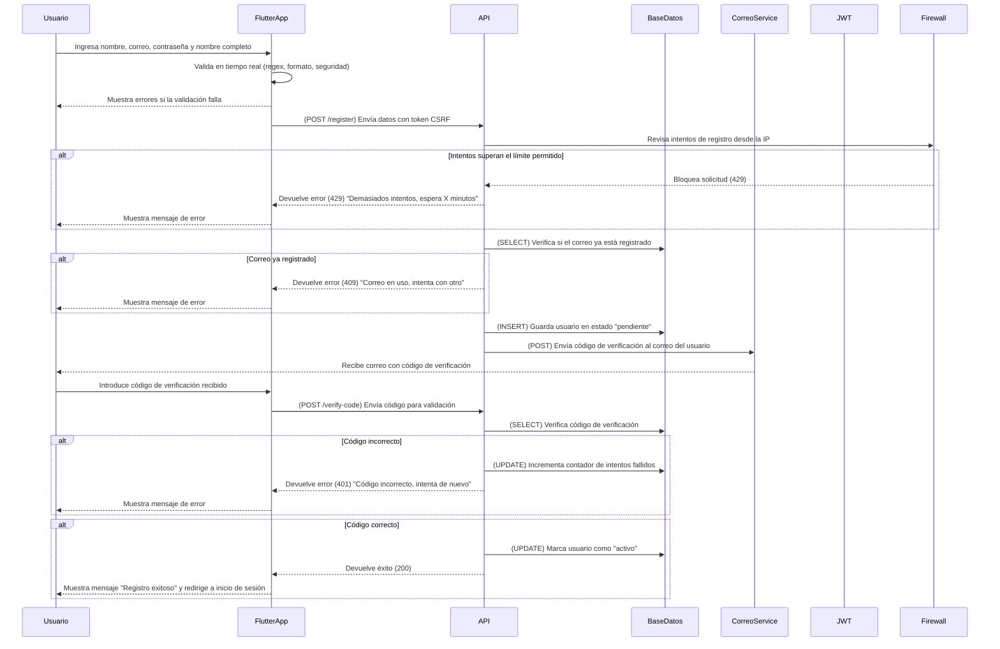

# Registro de usuario y validación de campos



## **Diagrama de Secuencia: Registro de Usuario (Flutter + API en Python + AWS)**

El **registro de usuario** sigue un flujo seguro donde:
- Se validan los campos en el frontend antes de enviarlos a la API.
- La API valida la existencia del correo y evita duplicados.
- Se envía un código de verificación al correo del usuario.
- El usuario confirma su correo antes de activar la cuenta.
- Se protege contra ataques de fuerza bruta y múltiples intentos fallidos.

---

## **✅ Seguridad en API y Backend**
1. **Protección contra registros masivos (Spam)**
   - Se impone un **límite de intentos** por dirección IP.
   - Se bloquea la IP temporalmente tras **X intentos fallidos** (429 Too Many Requests).
   - Se implementa **CAPTCHA** si se detectan intentos repetidos.

2. **Protección CSRF y HTTPS**
   - Se usa un **token CSRF** en cada solicitud de registro.
   - Toda la comunicación se realiza bajo **HTTPS**.

3. **Almacenamiento seguro de contraseñas**
   - Se utiliza **bcrypt** para **cifrar las contraseñas** antes de almacenarlas.
   - No se almacena la contraseña en texto plano.

4. **Verificación del correo electrónico**
   - Se genera un **código de verificación único**.
   - El código **expira en 10 minutos** por seguridad.
   - Se bloquea la cuenta tras **X intentos fallidos de verificación**.

5. **Protección de Tokens JWT**
   - Se genera un token JWT seguro con:
     - `iat` (issued at) → Momento de creación del token.
     - `exp` (expiration) → Expira en 1 hora.
   - Se almacena en **Flutter Secure Storage** para evitar exposición en localStorage.

---

## **✅ Métodos HTTP y Respuestas de la API**
| Método   | Endpoint       | Descripción                            | Código de respuesta       |
| -------- | -------------- | -------------------------------------- | ------------------------- |
| **POST** | `/register`    | Registra un nuevo usuario              | `201` (Created)           |
| **POST** | `/register`    | Si el correo ya está en uso            | `409` (Conflict)          |
| **POST** | `/register`    | Si hay demasiados intentos de registro | `429` (Too Many Requests) |
| **POST** | `/verify-code` | Verifica el código de confirmación     | `200` (Success)           |
| **POST** | `/verify-code` | Si el código es incorrecto             | `401` (Unauthorized)      |
| **POST** | `/verify-code` | Si la cuenta ya está verificada        | `409` (Conflict)          |
| **POST** | `/verify-code` | Si el código ha expirado               | `410` (Gone)              |

---

## ** Estructuras JSON de Solicitudes y Respuestas**

### ** 1. Solicitud desde Flutter (POST /register)**
```json
{
  "username": "juanperez",
  "email": "usuario@ejemplo.com",
  "password": "P@ssword123!",
  "full_name": "Juan Pérez",
  "device_info": {
    "device_id": "abc123",
    "device_name": "iPhone 13",
    "os_version": "iOS 16",
    "app_version": "2.1.0"
  }
}
```
### ✅ **Explicación:**
- `"username"` → Nombre único del usuario.
- `"email"` → Correo electrónico válido.
- `"password"` → Contraseña segura.
- `"full_name"` → Nombre completo.
- `"device_info"` → Información del dispositivo para seguridad.

---

### ** 2. Respuesta exitosa al registrarse (201 Created)**
```json
{
  "status": 201,
  "message": "Registro exitoso. Verifica tu correo para continuar.",
  "user_id": 12345
}
```

---

### ** 3. Respuesta si el correo ya existe (409 Conflict)**
```json
{
  "status": 409,
  "message": "El correo electrónico ya está registrado. Intenta con otro."
}
```

---

### ** 4. Solicitud de verificación de código (POST /verify-code)**
```json
{
  "email": "usuario@ejemplo.com",
  "verification_code": "123456"
}
```
---

### ** 5. Respuesta si el código es válido (200 OK)**
```json
{
  "status": 200,
  "message": "Correo verificado con éxito. Ya puedes iniciar sesión."
}
```

---

### ** 6. Respuesta si el código es incorrecto (401 Unauthorized)**
```json
{
  "status": 401,
  "message": "Código incorrecto. Intenta nuevamente.",
  "attempts_remaining": 2
}
```

---

### ** 7. Respuesta si el código ha expirado (410 Gone)**
```json
{
  "status": 410,
  "message": "El código de verificación ha expirado. Solicita uno nuevo."
}
```

---

## ** Resumen de Códigos de Estado HTTP**
| Código | Descripción                                 |
| ------ | ------------------------------------------- |
| `200`  | Verificación de correo exitosa              |
| `201`  | Usuario registrado correctamente            |
| `400`  | Datos faltantes en la solicitud             |
| `401`  | Código de verificación incorrecto           |
| `409`  | Correo ya registrado o cuenta ya verificada |
| `410`  | Código de verificación expirado             |
| `429`  | Demasiados intentos, acceso bloqueado       |

---

## ** Conclusión**
✅ **Flujo seguro de registro de usuarios** con validaciones en Flutter y API en **Python + AWS**.  
✅ **Protección contra ataques** de fuerza bruta y spam.  
✅ **Verificación por correo antes de activar cuenta**.  
✅ **Uso de JWT seguro y almacenamiento cifrado de contraseñas**.  
