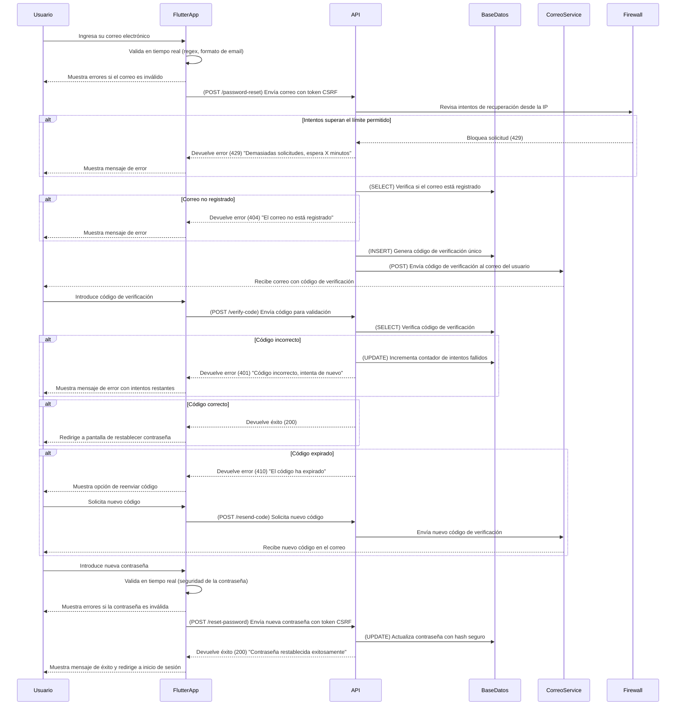

# Recuperación de Contraseña y Validación de Campos



---

## **Diagrama de Secuencia: Recuperación de Contraseña (Flutter + API en Python + AWS)**

El flujo de **recuperación de contraseña** garantiza seguridad y validaciones adecuadas para proteger el acceso a la cuenta del usuario.

---

### ✅ **Protecciones de Seguridad en API y Backend**
1. **Protección contra intentos masivos**
   - Se limita el número de intentos de recuperación por IP.
   - Se bloquea temporalmente tras demasiadas solicitudes repetidas (429 Too Many Requests).
   - Se solicita un **CAPTCHA** tras múltiples intentos fallidos.

2. **Verificación del correo electrónico**
   - Solo se permite la recuperación de cuentas registradas.
   - Se genera un código de verificación único.
   - **Expiración en 60 segundos** para evitar intentos de fuerza bruta.
   - Se permite reenviar código solo **después de X segundos**.

3. **Expiración y Reintentos**
   - Se permite **máximo 3 intentos de código** antes de bloquear la recuperación.
   - Tras 3 intentos fallidos, se bloquea la cuenta **temporalmente**.

4. **Almacenamiento seguro de contraseñas**
   - Las nuevas contraseñas se **cifran con bcrypt** antes de ser almacenadas.
   - Se verifica que la nueva contraseña no sea igual a la anterior.

---

## **✅ Métodos HTTP y Respuestas de la API**
| Método   | Endpoint          | Descripción                             | Código de respuesta       |
| -------- | ----------------- | --------------------------------------- | ------------------------- |
| **POST** | `/password-reset` | Solicita recuperación de contraseña     | `200` (Success)           |
| **POST** | `/password-reset` | Si el correo no está registrado         | `404` (Not Found)         |
| **POST** | `/password-reset` | Si hay demasiadas solicitudes           | `429` (Too Many Requests) |
| **POST** | `/verify-code`    | Verifica código de recuperación         | `200` (Success)           |
| **POST** | `/verify-code`    | Si el código es incorrecto              | `401` (Unauthorized)      |
| **POST** | `/verify-code`    | Si el código ha expirado                | `410` (Gone)              |
| **POST** | `/resend-code`    | Reenvía un nuevo código de verificación | `200` (Success)           |
| **POST** | `/reset-password` | Restablece la contraseña                | `200` (Success)           |

---

## **📌 Estructuras JSON de Solicitudes y Respuestas**

### **📌 1. Solicitud desde Flutter (POST /password-reset)**
```json
{
  "email": "usuario@ejemplo.com"
}
```

---

### **📌 2. Respuesta exitosa al solicitar recuperación (200 OK)**
```json
{
  "status": 200,
  "message": "Se ha enviado un código de verificación a tu correo electrónico."
}
```

---

### **📌 3. Respuesta si el correo no está registrado (404 Not Found)**
```json
{
  "status": 404,
  "message": "El correo electrónico no está registrado."
}
```

---

### **📌 4. Solicitud de verificación de código (POST /verify-code)**
```json
{
  "email": "usuario@ejemplo.com",
  "verification_code": "123456"
}
```

---

### **📌 5. Respuesta si el código es válido (200 OK)**
```json
{
  "status": 200,
  "message": "Código verificado con éxito. Ahora puedes restablecer tu contraseña."
}
```

---

### **📌 6. Respuesta si el código es incorrecto (401 Unauthorized)**
```json
{
  "status": 401,
  "message": "Código incorrecto. Te quedan 2 intentos."
}
```

---

### **📌 7. Respuesta si el código ha expirado (410 Gone)**
```json
{
  "status": 410,
  "message": "El código ha expirado. Solicita uno nuevo."
}
```

---

### **📌 8. Solicitud de restablecimiento de contraseña (POST /reset-password)**
```json
{
  "email": "usuario@ejemplo.com",
  "new_password": "NuevaP@ssword123!"
}
```

---

### **📌 9. Respuesta exitosa al restablecer contraseña (200 OK)**
```json
{
  "status": 200,
  "message": "Contraseña restablecida con éxito. Ahora puedes iniciar sesión."
}
```

---

## **📌 Resumen de Códigos de Estado HTTP**
| Código | Descripción                                 |
| ------ | ------------------------------------------- |
| `200`  | Recuperación de contraseña exitosa          |
| `401`  | Código de verificación incorrecto           |
| `404`  | Correo no registrado                        |
| `410`  | Código de verificación expirado             |
| `429`  | Demasiados intentos, recuperación bloqueada |

