# Recuperación de Contraseña y Validación de Campos

```mermaid
sequenceDiagram
    participant Usuario
    participant FlutterApp
    participant API
    participant BaseDatos
    participant CorreoService
    participant Firewall

    %% Usuario ingresa su correo en la app
    Usuario->>FlutterApp: Ingresa su correo electrónico
    FlutterApp->>FlutterApp: Valida en tiempo real (regex, formato de email)
    FlutterApp-->>Usuario: Muestra errores si el correo es inválido

    %% Envío de solicitud de recuperación de contraseña
    FlutterApp->>API: (POST /password-reset) Envía correo con token CSRF
    API->>Firewall: Revisa intentos de recuperación desde la IP

    %% Bloqueo por intentos repetidos
    alt Intentos superan el límite permitido
        Firewall-->>API: Bloquea solicitud (429)
        API-->>FlutterApp: Devuelve error (429) "Demasiadas solicitudes, espera X minutos"
        FlutterApp-->>Usuario: Muestra mensaje de error
    end

    %% Verificación del correo en la base de datos
    API->>BaseDatos: (SELECT) Verifica si el correo está registrado
    alt Correo no registrado
        API-->>FlutterApp: Devuelve error (404) "El correo no está registrado"
        FlutterApp-->>Usuario: Muestra mensaje de error
    end

    %% Generación y envío del código de verificación
    API->>BaseDatos: (INSERT) Genera código de verificación único
    API->>CorreoService: (POST) Envía código de verificación al correo del usuario
    CorreoService-->>Usuario: Recibe correo con código de verificación

    %% Usuario ingresa el código de verificación en la app
    Usuario->>FlutterApp: Introduce código de verificación
    FlutterApp->>API: (POST /verify-code) Envía código para validación
    API->>BaseDatos: (SELECT) Verifica código de verificación

    alt Código incorrecto
        API->>BaseDatos: (UPDATE) Incrementa contador de intentos fallidos
        API-->>FlutterApp: Devuelve error (401) "Código incorrecto, intenta de nuevo"
        FlutterApp-->>Usuario: Muestra mensaje de error con intentos restantes
    end

    alt Código correcto
        API-->>FlutterApp: Devuelve éxito (200)
        FlutterApp-->>Usuario: Redirige a pantalla de restablecer contraseña
    end

    %% Expiración del código de verificación
    alt Código expirado
        API-->>FlutterApp: Devuelve error (410) "El código ha expirado"
        FlutterApp-->>Usuario: Muestra opción de reenviar código
        Usuario->>FlutterApp: Solicita nuevo código
        FlutterApp->>API: (POST /resend-code) Solicita nuevo código
        API->>CorreoService: Envía nuevo código de verificación
        CorreoService-->>Usuario: Recibe nuevo código en el correo
    end

    %% Usuario ingresa nueva contraseña
    Usuario->>FlutterApp: Introduce nueva contraseña
    FlutterApp->>FlutterApp: Valida en tiempo real (seguridad de la contraseña)
    FlutterApp-->>Usuario: Muestra errores si la contraseña es inválida

    %% Envío de nueva contraseña
    FlutterApp->>API: (POST /reset-password) Envía nueva contraseña con token CSRF
    API->>BaseDatos: (UPDATE) Actualiza contraseña con hash seguro
    API-->>FlutterApp: Devuelve éxito (200) "Contraseña restablecida exitosamente"
    FlutterApp-->>Usuario: Muestra mensaje de éxito y redirige a inicio de sesión
```



---

## **Diagrama de Secuencia: Recuperación de Contraseña (Flutter + API en Python + AWS)**

El flujo de **recuperación de contraseña** garantiza seguridad y validaciones adecuadas para proteger el acceso a la cuenta del usuario.

---

### ✅ **Protecciones de Seguridad en API y Backend**
1. **Protección contra intentos masivos**
   - Se limita el número de intentos de recuperación por IP.
   - Se bloquea temporalmente tras demasiadas solicitudes repetidas (429 Too Many Requests).
   - Se solicita un **CAPTCHA** tras múltiples intentos fallidos.

2. **Verificación del correo electrónico**
   - Solo se permite la recuperación de cuentas registradas.
   - Se genera un código de verificación único.
   - **Expiración en 60 segundos** para evitar intentos de fuerza bruta.
   - Se permite reenviar código solo **después de X segundos**.

3. **Expiración y Reintentos**
   - Se permite **máximo 3 intentos de código** antes de bloquear la recuperación.
   - Tras 3 intentos fallidos, se bloquea la cuenta **temporalmente**.

4. **Almacenamiento seguro de contraseñas**
   - Las nuevas contraseñas se **cifran con bcrypt** antes de ser almacenadas.
   - Se verifica que la nueva contraseña no sea igual a la anterior.

---

## **✅ Métodos HTTP y Respuestas de la API**
| Método   | Endpoint          | Descripción                             | Código de respuesta       |
| -------- | ----------------- | --------------------------------------- | ------------------------- |
| **POST** | `/password-reset` | Solicita recuperación de contraseña     | `200` (Success)           |
| **POST** | `/password-reset` | Si el correo no está registrado         | `404` (Not Found)         |
| **POST** | `/password-reset` | Si hay demasiadas solicitudes           | `429` (Too Many Requests) |
| **POST** | `/verify-code`    | Verifica código de recuperación         | `200` (Success)           |
| **POST** | `/verify-code`    | Si el código es incorrecto              | `401` (Unauthorized)      |
| **POST** | `/verify-code`    | Si el código ha expirado                | `410` (Gone)              |
| **POST** | `/resend-code`    | Reenvía un nuevo código de verificación | `200` (Success)           |
| **POST** | `/reset-password` | Restablece la contraseña                | `200` (Success)           |

---

## **📌 Estructuras JSON de Solicitudes y Respuestas**

### **📌 1. Solicitud desde Flutter (POST /password-reset)**
```json
{
  "email": "usuario@ejemplo.com"
}
```

---

### **📌 2. Respuesta exitosa al solicitar recuperación (200 OK)**
```json
{
  "status": 200,
  "message": "Se ha enviado un código de verificación a tu correo electrónico."
}
```

---

### **📌 3. Respuesta si el correo no está registrado (404 Not Found)**
```json
{
  "status": 404,
  "message": "El correo electrónico no está registrado."
}
```

---

### **📌 4. Solicitud de verificación de código (POST /verify-code)**
```json
{
  "email": "usuario@ejemplo.com",
  "verification_code": "123456"
}
```

---

### **📌 5. Respuesta si el código es válido (200 OK)**
```json
{
  "status": 200,
  "message": "Código verificado con éxito. Ahora puedes restablecer tu contraseña."
}
```

---

### **📌 6. Respuesta si el código es incorrecto (401 Unauthorized)**
```json
{
  "status": 401,
  "message": "Código incorrecto. Te quedan 2 intentos."
}
```

---

### **📌 7. Respuesta si el código ha expirado (410 Gone)**
```json
{
  "status": 410,
  "message": "El código ha expirado. Solicita uno nuevo."
}
```

---

### **📌 8. Solicitud de restablecimiento de contraseña (POST /reset-password)**
```json
{
  "email": "usuario@ejemplo.com",
  "new_password": "NuevaP@ssword123!"
}
```

---

### **📌 9. Respuesta exitosa al restablecer contraseña (200 OK)**
```json
{
  "status": 200,
  "message": "Contraseña restablecida con éxito. Ahora puedes iniciar sesión."
}
```

---

## **📌 Resumen de Códigos de Estado HTTP**
| Código | Descripción                                 |
| ------ | ------------------------------------------- |
| `200`  | Recuperación de contraseña exitosa          |
| `401`  | Código de verificación incorrecto           |
| `404`  | Correo no registrado                        |
| `410`  | Código de verificación expirado             |
| `429`  | Demasiados intentos, recuperación bloqueada |

