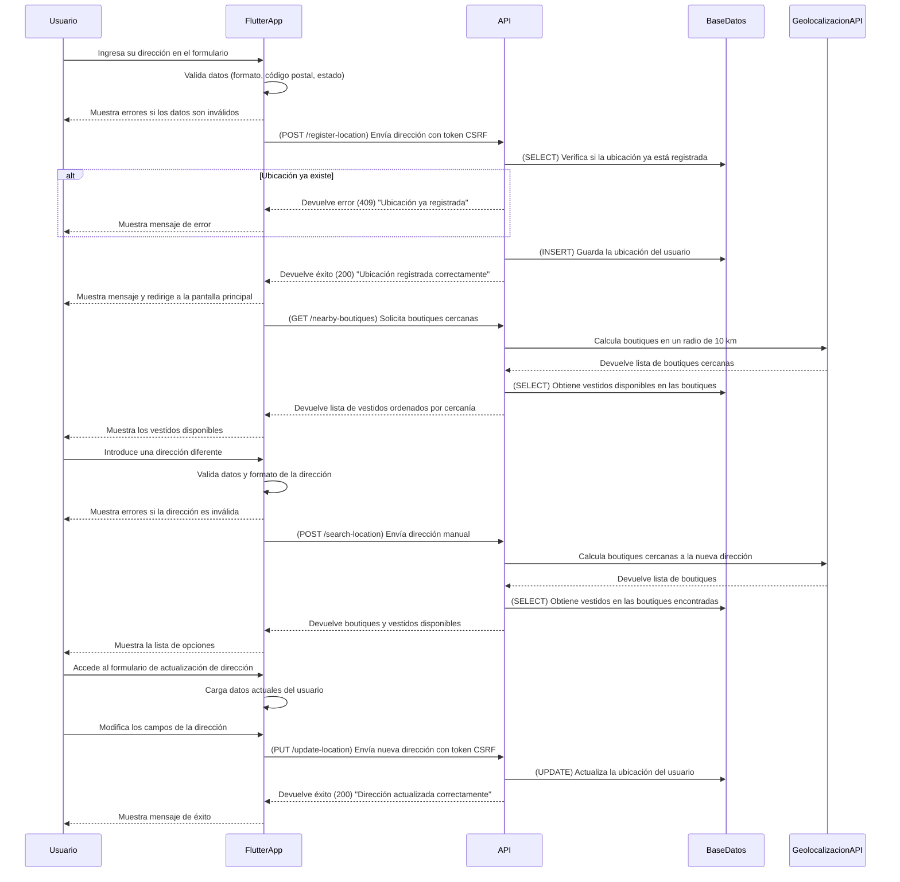

# **Gestión de Ubicación del Usuario**



---

## **Diagrama de Secuencia: Gestión de Ubicación (Flutter + API en Python + AWS)**

Este flujo garantiza la correcta administración de la ubicación del usuario para mejorar la experiencia en la búsqueda de productos.

---

### ✅ **Protecciones de Seguridad en API y Backend**
1. **Validación de datos antes de enviarlos al servidor**
   - Se valida que los datos ingresados sean correctos (código postal, estado, municipio).
   - Se asegura que la dirección cumpla con formatos esperados.

2. **Protección CSRF y HTTPS**
   - Se usa un **token CSRF** en cada solicitud de actualización de ubicación.
   - Toda comunicación debe realizarse bajo **HTTPS** para proteger los datos.

3. **Geolocalización segura y precisa**
   - Se usa una API de geolocalización para determinar la cercanía de boutiques.
   - Se implementa **caché de ubicación** para reducir consultas innecesarias.

---

## **✅ Métodos HTTP y Respuestas de la API**
| Método   | Endpoint             | Descripción                             | Código de respuesta |
| -------- | -------------------- | --------------------------------------- | ------------------- |
| **POST** | `/register-location` | Registra la ubicación del hogar         | `200` (Success)     |
| **POST** | `/register-location` | Si la ubicación ya existe               | `409` (Conflict)    |
| **GET**  | `/nearby-boutiques`  | Obtiene boutiques cercanas al usuario   | `200` (Success)     |
| **POST** | `/search-location`   | Filtra boutiques en una nueva ubicación | `200` (Success)     |
| **PUT**  | `/update-location`   | Actualiza la dirección del usuario      | `200` (Success)     |

---

## **📌 Estructuras JSON de Solicitudes y Respuestas**

### **📌 1. Solicitud desde Flutter (POST /register-location)**
```json
{
  "street": "Av. Reforma",
  "street_number": "123",
  "neighborhood": "Centro",
  "municipality": "Cuauhtémoc",
  "state": "Ciudad de México",
  "postal_code": "06000"
}
```

---

### **📌 2. Respuesta exitosa al registrar ubicación (200 OK)**
```json
{
  "status": 200,
  "message": "Ubicación registrada correctamente"
}
```

---

### **📌 3. Respuesta si la ubicación ya está registrada (409 Conflict)**
```json
{
  "status": 409,
  "message": "La ubicación ya está registrada en tu cuenta"
}
```

---

### **📌 4. Solicitud para obtener boutiques cercanas (GET /nearby-boutiques)**
```json
{
  "user_location": {
    "latitude": 19.432608,
    "longitude": -99.133209
  }
}
```

---

### **📌 5. Respuesta con boutiques cercanas (200 OK)**
```json
{
  "status": 200,
  "boutiques": [
    {
      "id": 1,
      "name": "Boutique Elegance",
      "distance_km": 2.5,
      "available_dresses": 15
    },
    {
      "id": 2,
      "name": "Glamour Fashion",
      "distance_km": 4.2,
      "available_dresses": 8
    }
  ]
}
```

---

### **📌 6. Solicitud para ingresar una ubicación manual (POST /search-location)**
```json
{
  "street": "Calle Insurgentes",
  "street_number": "789",
  "neighborhood": "Condesa",
  "municipality": "Cuauhtémoc",
  "state": "Ciudad de México",
  "postal_code": "06100"
}
```

---

### **📌 7. Respuesta con boutiques cercanas a la nueva dirección (200 OK)**
```json
{
  "status": 200,
  "boutiques": [
    {
      "id": 3,
      "name": "Chic Boutique",
      "distance_km": 1.8,
      "available_dresses": 10
    }
  ]
}
```

---

### **📌 8. Solicitud para actualizar la ubicación del usuario (PUT /update-location)**
```json
{
  "new_location": {
    "street": "Calle Álvaro Obregón",
    "street_number": "45",
    "neighborhood": "Roma Norte",
    "municipality": "Cuauhtémoc",
    "state": "Ciudad de México",
    "postal_code": "06700"
  }
}
```

---

### **📌 9. Respuesta exitosa tras actualizar la dirección (200 OK)**
```json
{
  "status": 200,
  "message": "Tu dirección ha sido actualizada correctamente"
}
```

---

## **📌 Resumen de Códigos de Estado HTTP**
| Código | Descripción               |
| ------ | ------------------------- |
| `200`  | Operación exitosa         |
| `409`  | Dirección ya registrada   |
| `500`  | Error en la base de datos |

