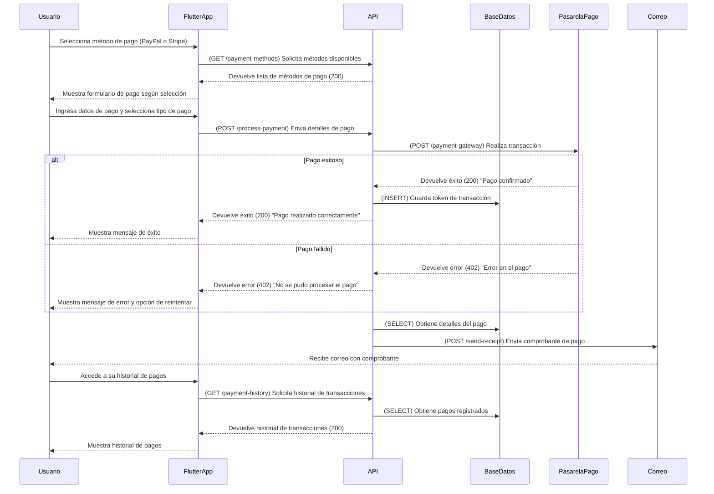

# **Gestión de Pagos**



---

## **Diagrama de Secuencia: Gestión de Pagos (Flutter + API en Python + AWS)**

Este flujo cubre la selección del método de pago, la transacción y la generación del comprobante.

---

### ✅ **Protecciones de Seguridad en API y Backend**
1. **Validación de pagos**
   - Se valida que el número de tarjeta y CVV sean correctos.
   - Se previene fraude con **3D Secure (Stripe)** y **Autenticación en 2 Pasos (PayPal)**.

2. **Protección CSRF y HTTPS**
   - Se usa **HTTPS** para todas las transacciones.
   - Se incluyen **tokens CSRF** para evitar ataques.

3. **Historial de transacciones**
   - Los pagos se registran en la base de datos con un ID único.
   - Se envía un **correo con el recibo** al usuario.

---

## **✅ Métodos HTTP y Respuestas de la API**
| Método   | Endpoint           | Descripción                                  | Código de respuesta                      |
| -------- | ------------------ | -------------------------------------------- | ---------------------------------------- |
| **GET**  | `/payment-methods` | Obtiene métodos de pago disponibles          | `200` (Success)                          |
| **POST** | `/process-payment` | Procesa el pago con la pasarela seleccionada | `200` (Success) / `402` (Payment Failed) |
| **GET**  | `/payment-history` | Obtiene historial de pagos del usuario       | `200` (Success)                          |
| **POST** | `/send-receipt`    | Envía comprobante de pago por correo         | `200` (Success)                          |

---

## **📌 Estructuras JSON de Solicitudes y Respuestas**

### **📌 1. Solicitud para obtener métodos de pago (GET /payment-methods)**
```json
{
  "status": 200,
  "methods": [
    { "id": 1, "name": "PayPal", "type": "online" },
    { "id": 2, "name": "Tarjeta de Crédito (Stripe)", "type": "card" }
  ]
}
```

---

### **📌 2. Solicitud para procesar pago (POST /process-payment)**
```json
{
  "user_id": 12345,
  "amount": 500.00,
  "payment_method": "Tarjeta de Crédito",
  "card_details": {
    "card_number": "4242424242424242",
    "expiry_date": "12/26",
    "cvv": "123"
  }
}
```

---

### **📌 3. Respuesta de pago exitoso (200 OK)**
```json
{
  "status": 200,
  "message": "Pago confirmado",
  "transaction_id": "TXN123456789"
}
```

---

### **📌 4. Respuesta de pago fallido (402 Payment Failed)**
```json
{
  "status": 402,
  "message": "No se pudo procesar el pago. Verifica los datos e inténtalo nuevamente."
}
```

---

### **📌 5. Solicitud para obtener historial de pagos (GET /payment-history)**
```json
{
  "status": 200,
  "transactions": [
    {
      "id": "TXN123456789",
      "amount": 500.00,
      "payment_method": "Tarjeta de Crédito",
      "date": "2024-02-25",
      "status": "Pagado"
    },
    {
      "id": "TXN987654321",
      "amount": 200.00,
      "payment_method": "PayPal",
      "date": "2024-02-20",
      "status": "Pagado"
    }
  ]
}
```

---

### **📌 6. Solicitud para enviar comprobante de pago (POST /send-receipt)**
```json
{
  "user_email": "usuario@ejemplo.com",
  "transaction_id": "TXN123456789",
  "amount": 500.00,
  "payment_method": "Tarjeta de Crédito",
  "date": "2024-02-25"
}
```

---

### **📌 7. Respuesta de envío de comprobante exitoso (200 OK)**
```json
{
  "status": 200,
  "message": "Comprobante enviado a usuario@ejemplo.com"
}
```
