# **Cita en Boutique**

```mermaid
sequenceDiagram
    participant Usuario
    participant FlutterApp
    participant API
    participant BaseDatos
    participant PasarelaPago
    participant Boutique

    %% Asistencia a la Cita
    Boutique->>API: (GET /appointments) Solicita citas agendadas
    API->>BaseDatos: (SELECT) Obtiene citas registradas
    alt Citas disponibles
        API-->>Boutique: Devuelve lista de citas (200)
        Boutique-->>Usuario: Muestra citas agendadas
    else No hay citas
        API-->>Boutique: Devuelve error (404) "No hay citas agendadas"
        Boutique-->>Usuario: Muestra mensaje de error
    end

    %% Prueba del Vestido
    Usuario->>Boutique: Asiste a la boutique para probar el vestido
    Boutique->>API: (POST /verify-appointment) Verifica cita del usuario
    API->>BaseDatos: (SELECT) Confirma cita en el sistema
    API-->>Boutique: Cita confirmada (200)

    %% Confirmación de Renta
    Usuario->>FlutterApp: Confirma renta del vestido
    FlutterApp->>API: (GET /dress-price?dress_id=X) Obtiene precio del vestido
    API->>BaseDatos: (SELECT) Obtiene detalles del precio
    API-->>FlutterApp: Devuelve precio del vestido (200)

    Usuario->>FlutterApp: Ingresa datos de pago
    FlutterApp->>PasarelaPago: (POST /process-payment) Procesa pago
    alt Pago exitoso
        PasarelaPago-->>API: Devuelve éxito (200) "Pago confirmado"
        API->>BaseDatos: (INSERT) Guarda transacción en la base de datos
        API-->>FlutterApp: Devuelve éxito (200) "Pago realizado correctamente"
        FlutterApp-->>Usuario: Muestra mensaje de éxito
    else Pago fallido
        PasarelaPago-->>API: Devuelve error (402) "No se pudo procesar el pago"
        API-->>FlutterApp: Devuelve error (402) "Error en el pago"
        FlutterApp-->>Usuario: Muestra mensaje de error y opción de reintentar
    end

    %% Reagendar Cita
    Usuario->>FlutterApp: Selecciona opción "Reagendar cita"
    FlutterApp->>API: (GET /available-dates) Solicita fechas disponibles
    API->>BaseDatos: (SELECT) Obtiene nuevas fechas
    alt Fechas disponibles
        API-->>FlutterApp: Devuelve lista de fechas (200)
        FlutterApp-->>Usuario: Muestra calendario con opciones
        Usuario->>FlutterApp: Selecciona nueva fecha
        FlutterApp->>API: (PUT /update-appointment) Actualiza cita en la base de datos
        API->>BaseDatos: (UPDATE) Modifica cita con nueva fecha
        API-->>FlutterApp: Devuelve éxito (200) "Cita reagendada correctamente"
        FlutterApp-->>Usuario: Muestra mensaje de éxito
    else No hay fechas
        API-->>FlutterApp: Devuelve error (400) "No hay fechas disponibles"
        FlutterApp-->>Usuario: Muestra mensaje de error
    end

    %% Cancelación de Cita
    Usuario->>FlutterApp: Selecciona opción "Cancelar cita"
    FlutterApp->>API: (DELETE /cancel-appointment) Solicita cancelación
    API->>BaseDatos: (DELETE) Elimina cita de la base de datos
    API->>PasarelaPago: (POST /charge-fee) Cobra anticipo
    alt Cobro exitoso
        PasarelaPago-->>API: Devuelve éxito (200) "Anticipo cobrado"
        API-->>FlutterApp: Devuelve éxito (200) "Cita cancelada y cobro realizado"
        FlutterApp-->>Usuario: Muestra mensaje de confirmación
    else Error en el cobro
        PasarelaPago-->>API: Devuelve error (402) "No se pudo procesar el cobro"
        API-->>FlutterApp: Devuelve error (402) "No se pudo cancelar la cita"
        FlutterApp-->>Usuario: Muestra mensaje de error
    end

    %% Cambio de Boutique
    Usuario->>FlutterApp: Selecciona opción "Cambiar boutique"
    FlutterApp->>API: (GET /available-boutiques) Solicita boutiques disponibles
    API->>BaseDatos: (SELECT) Obtiene lista de boutiques
    alt Hay boutiques disponibles
        API-->>FlutterApp: Devuelve lista de boutiques (200)
        FlutterApp-->>Usuario: Muestra boutiques
        Usuario->>FlutterApp: Selecciona nueva boutique
        FlutterApp->>API: (PUT /update-appointment) Actualiza la cita en la base de datos
        API->>BaseDatos: (UPDATE) Modifica cita con nueva boutique y fecha
        API-->>FlutterApp: Devuelve éxito (200) "Cita actualizada correctamente"
        FlutterApp-->>Usuario: Muestra mensaje de éxito
    else No hay boutiques
        API-->>FlutterApp: Devuelve error (404) "No hay boutiques disponibles"
        FlutterApp-->>Usuario: Muestra mensaje de error
    end

    %% Inasistencia a la Cita
    Boutique->>API: (POST /missed-appointment) Reporta inasistencia del usuario
    API->>BaseDatos: (UPDATE) Marca cita como inasistida
    alt Segunda inasistencia
        API->>PasarelaPago: (POST /charge-fee) Cobra anticipo
        alt Cobro exitoso
            PasarelaPago-->>API: Devuelve éxito (200) "Anticipo cobrado"
            API-->>FlutterApp: Devuelve éxito (200) "Se ha cobrado el anticipo"
            FlutterApp-->>Usuario: Muestra mensaje de confirmación
        else Error en el cobro
            PasarelaPago-->>API: Devuelve error (402) "No se pudo procesar el cobro"
            API-->>FlutterApp: Devuelve error (402) "Error en el cobro"
            FlutterApp-->>Usuario: Muestra mensaje de error
        end
    else Primera inasistencia
        API-->>FlutterApp: Devuelve advertencia (200) "Primera inasistencia registrada"
        FlutterApp-->>Usuario: Muestra advertencia de inasistencia
    end
```



---

## **Diagrama de Secuencia: Cita en Boutique (Flutter + API en Python + AWS)**

Este flujo cubre la gestión de citas, asistencia, renta de vestidos, reagendamiento y cancelaciones.

---

### ✅ **Protecciones de Seguridad en API y Backend**
1. **Optimización de consultas**
   - Se usa **paginación** para listar citas y boutiques disponibles.
   - Se implementan **índices en las tablas** para mejorar la velocidad.

2. **Protección CSRF y HTTPS**
   - Todas las solicitudes deben realizarse con **HTTPS**.
   - Se incluyen **tokens CSRF** en las transacciones.

3. **Gestión de pagos y cancelaciones**
   - Se cobra el anticipo solo en casos de segunda inasistencia.
   - Se permite reagendar citas sin penalización.
---

## **📌 1. Solicitud para obtener citas agendadas (GET /appointments)**  
### 📥 **Solicitud**
```json
{
  "user_id": 12345
}
```

### 📤 **Respuesta Exitosa (200 OK)**
```json
{
  "status": 200,
  "appointments": [
    {
      "appointment_id": 9876,
      "boutique": "Boutique Elegance",
      "dress_id": 55,
      "dress_name": "Vestido de Gala Rojo",
      "date": "2024-03-10",
      "time": "16:00",
      "status": "Confirmada"
    },
    {
      "appointment_id": 5432,
      "boutique": "Glamour Fashion",
      "dress_id": 66,
      "dress_name": "Vestido Azul de Fiesta",
      "date": "2024-03-12",
      "time": "15:00",
      "status": "Pendiente"
    }
  ]
}
```

### 📤 **Respuesta si no hay citas (404 Not Found)**
```json
{
  "status": 404,
  "message": "No hay citas agendadas para este mes."
}
```

---

## **📌 2. Solicitud para verificar asistencia a la cita (POST /verify-appointment)**  
### 📥 **Solicitud**
```json
{
  "appointment_id": 9876,
  "user_id": 12345
}
```

### 📤 **Respuesta Exitosa (200 OK)**
```json
{
  "status": 200,
  "message": "Cita confirmada",
  "appointment_details": {
    "boutique": "Boutique Elegance",
    "date": "2024-03-10",
    "time": "16:00"
  }
}
```

### 📤 **Respuesta si la cita no existe (400 Bad Request)**
```json
{
  "status": 400,
  "message": "La cita no está registrada o ya fue atendida."
}
```

---

## **📌 3. Solicitud para obtener el precio del vestido (GET /dress-price?dress_id=X)**  
### 📥 **Solicitud**
```json
{
  "dress_id": 55
}
```

### 📤 **Respuesta Exitosa (200 OK)**
```json
{
  "status": 200,
  "dress_id": 55,
  "name": "Vestido de Gala Rojo",
  "price": 120.00,
  "currency": "USD"
}
```

---

## **📌 4. Solicitud para procesar pago de renta (POST /process-payment)**  
### 📥 **Solicitud**
```json
{
  "user_id": 12345,
  "appointment_id": 9876,
  "amount": 120.00,
  "payment_method": "Tarjeta de Crédito",
  "card_details": {
    "card_number": "4242424242424242",
    "expiry_date": "12/26",
    "cvv": "123"
  }
}
```

### 📤 **Respuesta de Pago Exitoso (200 OK)**
```json
{
  "status": 200,
  "message": "Pago confirmado",
  "transaction_id": "TXN9988776655"
}
```

### 📤 **Respuesta de Pago Fallido (402 Payment Required)**
```json
{
  "status": 402,
  "message": "No se pudo procesar el pago. Verifica los datos de tu tarjeta e inténtalo nuevamente."
}
```

---

## **📌 5. Solicitud para reagendar cita (PUT /update-appointment)**  
### 📥 **Solicitud**
```json
{
  "appointment_id": 9876,
  "new_date": "2024-03-15",
  "new_time": "14:00"
}
```

### 📤 **Respuesta de Reagendamiento Exitoso (200 OK)**
```json
{
  "status": 200,
  "message": "Cita reagendada correctamente",
  "new_date": "2024-03-15",
  "new_time": "14:00"
}
```

### 📤 **Respuesta si no hay fechas disponibles (400 Bad Request)**
```json
{
  "status": 400,
  "message": "No hay fechas disponibles para reagendar."
}
```

---

## **📌 6. Solicitud para cancelar cita (DELETE /cancel-appointment)**  
### 📥 **Solicitud**
```json
{
  "appointment_id": 9876,
  "user_id": 12345
}
```

### 📤 **Respuesta de Cancelación Exitosa (200 OK)**
```json
{
  "status": 200,
  "message": "Cita cancelada y cobro realizado",
  "cancellation_fee": 30.00,
  "currency": "USD"
}
```

### 📤 **Respuesta si hay error en el cobro de cancelación (402 Payment Required)**
```json
{
  "status": 402,
  "message": "No se pudo procesar el cobro de la cancelación."
}
```

---

## **📌 7. Solicitud para cambiar boutique (PUT /update-appointment)**  
### 📥 **Solicitud**
```json
{
  "appointment_id": 9876,
  "new_boutique_id": 3,
  "new_date": "2024-03-18",
  "new_time": "17:00"
}
```

### 📤 **Respuesta de Cambio de Boutique Exitoso (200 OK)**
```json
{
  "status": 200,
  "message": "Cita actualizada correctamente",
  "new_boutique": "Glamour Fashion",
  "new_date": "2024-03-18",
  "new_time": "17:00"
}
```

### 📤 **Respuesta si no hay boutiques disponibles (404 Not Found)**
```json
{
  "status": 404,
  "message": "No hay boutiques disponibles con el vestido seleccionado."
}
```

---

## **📌 8. Solicitud para registrar inasistencia (POST /missed-appointment)**  
### 📥 **Solicitud**
```json
{
  "appointment_id": 9876,
  "user_id": 12345
}
```

### 📤 **Respuesta de Primera Inasistencia Registrada (200 OK)**
```json
{
  "status": 200,
  "message": "Primera inasistencia registrada. Se enviará un recordatorio para la próxima cita."
}
```

### 📤 **Respuesta si es la Segunda Inasistencia y se cobra penalización (200 OK)**
```json
{
  "status": 200,
  "message": "Se ha cobrado el anticipo por inasistencia a la cita.",
  "charged_amount": 30.00,
  "currency": "USD",
  "transaction_id": "TXN11223344"
}
```

### 📤 **Respuesta si hay error en el cobro de la penalización (402 Payment Required)**
```json
{
  "status": 402,
  "message": "No se pudo procesar el cobro de la penalización."
}
```
---

## **✅ Métodos HTTP y Respuestas de la API**
| Método     | Endpoint              | Descripción                     | Código de respuesta                      |
| ---------- | --------------------- | ------------------------------- | ---------------------------------------- |
| **GET**    | `/appointments`       | Obtiene citas agendadas         | `200` (Success) / `404` (No citas)       |
| **POST**   | `/verify-appointment` | Verifica asistencia del usuario | `200` (Success) / `400` (Invalid)        |
| **POST**   | `/process-payment`    | Procesa pago de renta           | `200` (Success) / `402` (Payment Failed) |
| **PUT**    | `/update-appointment` | Modifica detalles de la cita    | `200` (Success) / `500` (Error)          |
| **DELETE** | `/cancel-appointment` | Cancela cita y cobra anticipo   | `200` (Success) / `402` (Payment Failed) |
| **POST**   | `/missed-appointment` | Reporta inasistencia            | `200` (Warning) / `402` (Charge Failed)  |

Aquí están las respuestas en formato JSON para complementar tu documentación sobre la gestión de citas en boutique: