# **Gestión de Entrega**

```mermaid
sequenceDiagram
    participant Usuario
    participant FlutterApp
    participant API
    participant BaseDatos
    participant PasarelaPago
    participant Boutique

    %% Pagar Garantía
    Usuario->>FlutterApp: Selecciona método de pago (PayPal o Stripe)
    FlutterApp->>API: (POST /process-guarantee-payment) Envía datos de pago
    API->>PasarelaPago: (POST /payment-gateway) Procesa pago
    alt Pago exitoso
        PasarelaPago-->>API: Devuelve éxito (200) "Garantía pagada"
        API->>BaseDatos: (INSERT) Guarda transacción
        API-->>FlutterApp: Devuelve éxito (200) "Pago confirmado"
        FlutterApp-->>Usuario: Muestra mensaje de éxito
    else Pago fallido
        PasarelaPago-->>API: Devuelve error (402) "No se pudo procesar el pago"
        API-->>FlutterApp: Devuelve error (402) "Pago fallido"
        FlutterApp-->>Usuario: Muestra mensaje de error y opción de reintentar
    end

    %% Retención de Garantía
    API->>BaseDatos: (UPDATE) Retiene garantía por 7 días
    API-->>Usuario: Notifica sobre la retención

    %% Recepción del Vestido
    Usuario->>Boutique: Entrega el vestido
    Boutique->>API: (POST /update-dress-status) Cambia estado del vestido a "suspendido"
    API->>BaseDatos: (UPDATE) Estado del vestido actualizado
    API-->>FlutterApp: Devuelve éxito (200) "Vestido recibido"

    %% Devolución del Vestido
    Usuario->>Boutique: Devuelve vestido
    Boutique->>API: (POST /update-dress-status) Cambia estado del vestido a "disponible"
    API->>BaseDatos: (UPDATE) Estado del vestido actualizado
    API-->>FlutterApp: Devuelve éxito (200) "Vestido devuelto"

    %% Confirmación del Estado del Vestido
    Boutique->>FlutterApp: Califica estado del vestido (sucio, roto, perdido)
    FlutterApp->>API: (POST /rate-dress-condition) Guarda evaluación
    API->>BaseDatos: (INSERT) Registra estado del vestido

    %% Calificación de la Boutique
    Usuario->>FlutterApp: Califica la boutique (1-5 estrellas)
    FlutterApp->>API: (POST /rate-boutique) Guarda calificación
    API->>BaseDatos: (INSERT) Registra calificación de la boutique

    %% Cobro de Penalización
    alt Vestido en mal estado o perdido
        Boutique->>FlutterApp: Cobra penalización
        FlutterApp->>API: (POST /process-penalty) Solicita cobro
        API->>PasarelaPago: (POST /charge-penalty) Procesa cobro
        alt Cobro exitoso
            PasarelaPago-->>API: Devuelve éxito (200) "Penalización cobrada"
            API->>BaseDatos: (INSERT) Guarda transacción
            API-->>FlutterApp: Devuelve éxito (200) "Cobro realizado"
            FlutterApp-->>Usuario: Muestra mensaje de confirmación
        else Cobro fallido
            PasarelaPago-->>API: Devuelve error (402) "No se pudo procesar el cobro"
            API-->>FlutterApp: Devuelve error (402) "Error en el cobro"
            FlutterApp-->>Usuario: Muestra mensaje de error
        end
    else Vestido devuelto en buen estado
        API->>BaseDatos: (UPDATE) Libera garantía
        API-->>FlutterApp: Devuelve éxito (200) "Garantía liberada"
        FlutterApp-->>Usuario: Muestra mensaje de confirmación
    end
```



---

## **Diagrama de Secuencia: Gestión de Entrega (Flutter + API en Python + AWS)**

Este flujo cubre el pago y retención de garantía, la recepción del vestido, su devolución, calificaciones y el cobro de penalizaciones.

---

### ✅ **Protecciones de Seguridad en API y Backend**
1. **Validación de pagos y cobros**
   - Se previenen fraudes con autenticación **3D Secure** en pagos.
   - Se protege contra cargos indebidos con validaciones de estado del vestido.

2. **Protección CSRF y HTTPS**
   - Se usa **HTTPS** para todas las transacciones.
   - Se incluyen **tokens CSRF** en pagos y penalizaciones.

3. **Historial de pagos y devoluciones**
   - Se registran todas las transacciones en la base de datos.
   - Se permite consultar el estado de la garantía en la app.

---

## **✅ Métodos HTTP y Respuestas de la API**
| Método   | Endpoint                     | Descripción                              | Código de respuesta                      |
| -------- | ---------------------------- | ---------------------------------------- | ---------------------------------------- |
| **POST** | `/process-guarantee-payment` | Procesa pago de garantía                 | `200` (Success) / `402` (Payment Failed) |
| **POST** | `/update-dress-status`       | Actualiza estado del vestido             | `200` (Success) / `500` (Error)          |
| **POST** | `/rate-dress-condition`      | Guarda evaluación del estado del vestido | `200` (Success)                          |
| **POST** | `/rate-boutique`             | Guarda calificación de la boutique       | `200` (Success)                          |
| **POST** | `/process-penalty`           | Cobra penalización                       | `200` (Success) / `402` (Payment Failed) |

---

## **📌 Estructuras JSON de Solicitudes y Respuestas**

### **📌 1. Solicitud para procesar pago de garantía (POST /process-guarantee-payment)**
```json
{
  "user_id": 12345,
  "amount": 100.00,
  "payment_method": "Tarjeta de Crédito",
  "card_details": {
    "card_number": "4242424242424242",
    "expiry_date": "12/26",
    "cvv": "123"
  }
}
```

---

### **📌 2. Respuesta de pago exitoso (200 OK)**
```json
{
  "status": 200,
  "message": "Pago de garantía confirmado",
  "transaction_id": "TXN987654321"
}
```

---

### **📌 3. Solicitud para actualizar estado del vestido (POST /update-dress-status)**
```json
{
  "dress_id": 10,
  "new_status": "suspendido"
}
```

---

### **📌 4. Respuesta de actualización de estado exitoso (200 OK)**
```json
{
  "status": 200,
  "message": "Estado del vestido actualizado correctamente"
}
```

---

### **📌 5. Solicitud para registrar evaluación del vestido (POST /rate-dress-condition)**
```json
{
  "dress_id": 10,
  "condition": "roto"
}
```

---

### **📌 6. Respuesta de evaluación guardada (200 OK)**
```json
{
  "status": 200,
  "message": "Estado del vestido registrado"
}
```

---

### **📌 7. Solicitud para cobrar penalización (POST /process-penalty)**
```json
{
  "user_id": 12345,
  "penalty_amount": 50.00
}
```

---

### **📌 8. Respuesta de cobro exitoso (200 OK)**
```json
{
  "status": 200,
  "message": "Cobro de penalización realizado",
  "transaction_id": "TXN555555555"
}
```

---

### **📌 9. Respuesta si el cobro falla (402 Payment Failed)**
```json
{
  "status": 402,
  "message": "No se pudo procesar el cobro. Inténtalo nuevamente."
}
```
