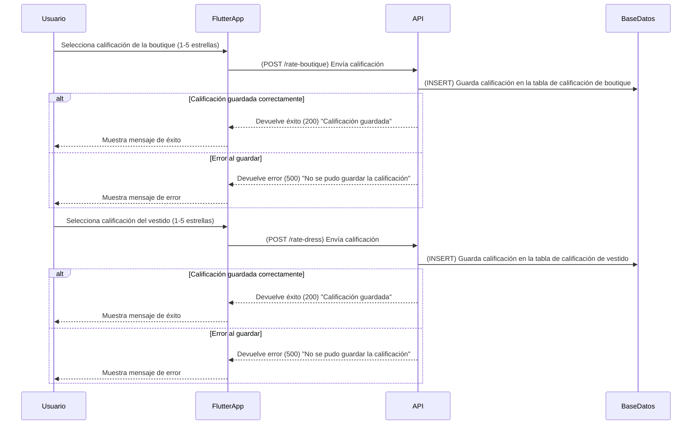

# **Post-Renta: Calificación de la Experiencia**



---

## **📌 Métodos HTTP y Respuestas de la API**
| Método   | Endpoint         | Descripción                           | Código de respuesta             |
| -------- | ---------------- | ------------------------------------- | ------------------------------- |
| **POST** | `/rate-boutique` | Guarda la calificación de la boutique | `200` (Success) / `500` (Error) |
| **POST** | `/rate-dress`    | Guarda la calificación del vestido    | `200` (Success) / `500` (Error) |

---

## **📌 1. Solicitud para calificar la boutique (POST /rate-boutique)**
### 📥 **Solicitud**
```json
{
  "user_id": 12345,
  "boutique_id": 67,
  "rating": 5,
  "comment": "Excelente atención y servicio."
}
```

### 📤 **Respuesta de Calificación Guardada (200 OK)**
```json
{
  "status": 200,
  "message": "Calificación guardada correctamente",
  "boutique_id": 67,
  "rating": 5
}
```

### 📤 **Respuesta de Error al Guardar (500 Internal Server Error)**
```json
{
  "status": 500,
  "message": "No se pudo guardar la calificación. Por favor, inténtalo nuevamente."
}
```

---

## **📌 2. Solicitud para calificar el vestido (POST /rate-dress)**
### 📥 **Solicitud**
```json
{
  "user_id": 12345,
  "dress_id": 55,
  "rating": 4,
  "comment": "Vestido hermoso, pero un poco ajustado."
}
```

### 📤 **Respuesta de Calificación Guardada (200 OK)**
```json
{
  "status": 200,
  "message": "Calificación guardada correctamente",
  "dress_id": 55,
  "rating": 4
}
```

### 📤 **Respuesta de Error al Guardar (500 Internal Server Error)**
```json
{
  "status": 500,
  "message": "No se pudo guardar la calificación. Por favor, inténtalo nuevamente."
}
```

---

## **📌 Optimizaciones y Mejoras**
### ✅ **Notificaciones Push**
- **Cuando la calificación es guardada correctamente**, se puede enviar una **notificación push** al usuario con un mensaje de confirmación.

### ✅ **Historial de Calificaciones**
- El usuario podrá ver **un historial de todas sus calificaciones**, con detalles de cada boutique y vestido evaluado.

### ✅ **Validación en Tiempo Real**
- La interfaz **valida que el usuario seleccione una calificación** antes de enviarla, evitando errores o registros vacíos.

